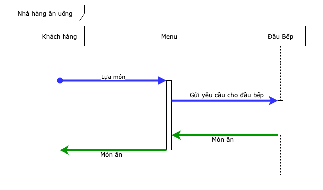
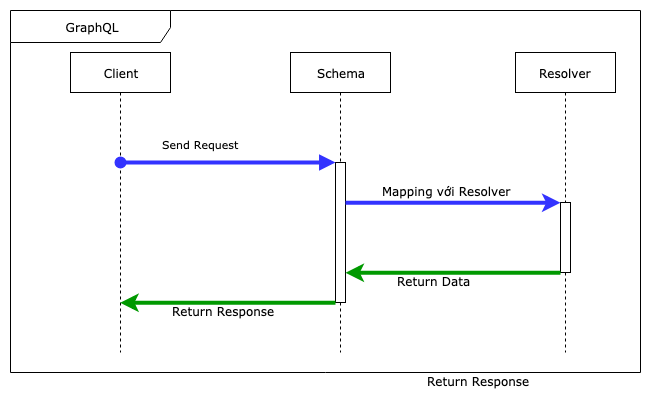
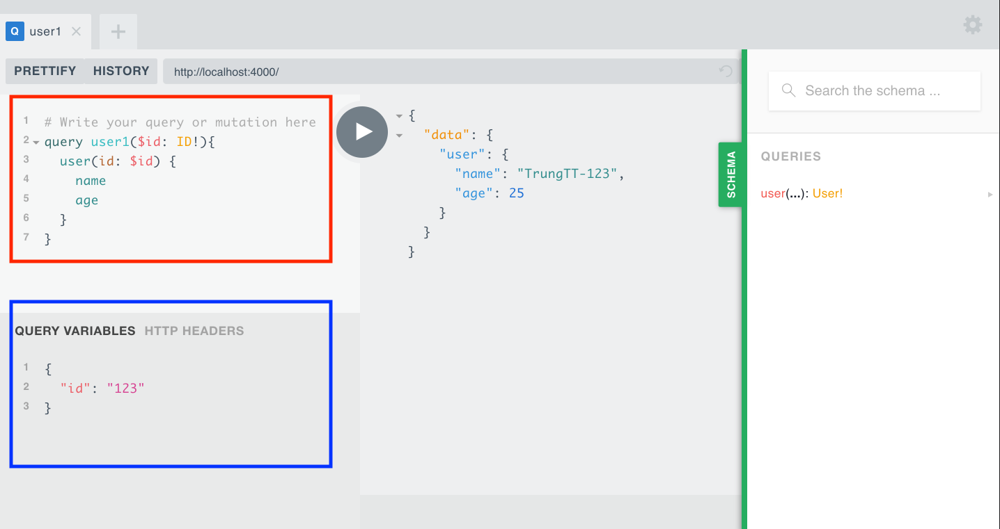

# 2. GraphQL's Concept - Các khái niệp cơ bản - Query

STT|Nội Dung|
:---:|---|
**I**|[Concept của GraphQL](#concept)
**II**|[Các khái niệm cơ bản trong GraphQL](#type)<br><br>&emsp; [1. Schema](#schema)<br>&emsp;&emsp;&emsp;[a. Field](#field)<br>&emsp;&emsp;&emsp;[b. Argument](#arg)<br>&emsp;&emsp;&emsp;[c. Fragment](#fragment)<br>&emsp;&emsp;&emsp;[d. Variable](#variable)<br>&emsp;&emsp;&emsp;[e. Types](#types)<br><br>&emsp; [2. Resolver](#resolver)
**III**|[Thực hành Query](#query)<br>
**IV**|[Mục tiêu cần đạt được sau buổi học](#summary)

<br>

## I. Concept của GraphQL <a id="concept"></a>:
### 1. Ví dụ với nhà hàng ăn uống:
###### Hãy tưởng tượng có một nhà hàng bao gồm:
 - **Menu**: mô tả những món ăn nào được phục vụ ở nhà hàng.
 - **Đầu Bếp**: dựa vào menu khi khách hàng yêu cầu để nấu món ăn.

###### Quy trình làm việc:



<br>

### 2. Với GraphQL Server:
###### Tương tự với ví dụ nhà hàng ở trên, GraphQLServer sẽ có mô hình tương ứng sau:
_|_|_|_
---|---|---|---
**Nhà Hàng**|Khách Hàng|Menu|Đầu Bếp|Nhà Bếp
**GraphQLServer**|Client|Schema (Type Defination)|Resolvers



###### Tóm lại GraphQL bao gồm 2 phần chính:
 - **Schema**: được dùng như là một bản mô tả giao dịch giữa client và server để xác định client có thể truy cập dữ liệu như thế nào.
 - **Resolvers**: implement logic cho API. Resolver có thể gọi câu truy vấn đến DB thông qua ORM, hoặc có thể gọi đến 1 API khác tùy ý. Tùy thuộc vào nghiệp vụ xử lý.


 > Nếu tại đây bạn vẫn thắc mắc concept này có không có gì khác biệt so với RESTful thì có thể xem lại [so sánh giữa RESTful và GraphQL ở đây](https://github.com/thientrung/graphql-tutorial/tree/lesson1#2-so-s%C3%A1nh-gi%E1%BB%AFa-restful-v%C3%A0-graphql).
----

 ## II. Các khái niệm cơ bản trong GraphQL  <a id="type"></a>:

 ### 1. Schema<a id="schema"></a>:

 #### &emsp; *a. Field <a id="field" href="https://graphql.github.io/learn/queries/#fields">(tìm hiểu thêm tại đây)</a>:*
> Là thành phần cơ bản nhất của schema. Bản chất của GraphQL là về việc yêu cầu các field cụ thể trên các object.

&emsp; Ví dụ sau: `id`, `name` và `age` là các field của `user`

Request|Response
---|---
**query** {<br>&emsp;user {<br>&emsp;&emsp;id <br>&emsp;&emsp;name <br>&emsp;&emsp;age<br>&emsp;}<br>}<br><br><br>|{<br>&emsp;"data": {<br>&emsp;&emsp;"user": {<br>&emsp;&emsp;&emsp;`"id": "123abc"` <br>&emsp;&emsp;&emsp;`"name": "TrungTT"` <br>&emsp;&emsp;&emsp;`"age": 25`<br>&emsp;&emsp;}<br>&emsp;}<br>}

> Bạn cũng có thể truy vấn các field lồng nhau và có thể trả về mảng dữ liệu

Request|Response
---|---
**query** {<br>&emsp;user {<br>&emsp;&emsp;name <br>&emsp;&emsp;courses {<br>&emsp;&emsp;&emsp;name<br>&emsp;&emsp;&emsp;teacher<br>&emsp;&emsp;}<br>}<br><br><br><br><br><br><br><br><br><br>|{<br>&emsp;&emsp;"data": {<br>&emsp;&emsp;&emsp;&emsp;"user": {<br>&emsp;&emsp;&emsp;&emsp;&emsp;&emsp;`"name": "TrungTT"`, <br>&emsp;&emsp;&emsp;&emsp;&emsp;&emsp;`"courses"`: [<br>&emsp;&emsp;&emsp;&emsp;&emsp;&emsp;&emsp;&emsp;{<br>&emsp;&emsp;&emsp;&emsp;&emsp;&emsp;&emsp;&emsp;&emsp;`"name": "Embedded"`,<br>&emsp;&emsp;&emsp;&emsp;&emsp;&emsp;&emsp;&emsp;&emsp;`"teacher": "TrongVN"`<br>&emsp;&emsp;&emsp;&emsp;&emsp;&emsp;&emsp;&emsp;},<br>&emsp;&emsp;&emsp;&emsp;&emsp;&emsp;&emsp;&emsp;{<br>&emsp;&emsp;&emsp;&emsp;&emsp;&emsp;&emsp;&emsp;&emsp;`"name": "C++"`,<br>&emsp;&emsp;&emsp;&emsp;&emsp;&emsp;&emsp;&emsp;&emsp;`"teacher: "AnhTQ"`<br>&emsp;&emsp;&emsp;&emsp;&emsp;&emsp;&emsp;&emsp;}<br>&emsp;&emsp;&emsp;&emsp;&emsp;&emsp;]<br>&emsp;&emsp;&emsp;&emsp;}<br>&emsp;&emsp;}<br>}

<br>

 #### &emsp; *b. Arguments <a id="arg" href="https://graphql.github.io/learn/queries/#arguments">(tìm hiểu thêm tại đây)</a>:*

 > Bạn có thể truyền thêm aguments vào câu truy vấn như sau:

Request|Response
---|---
**query** {<br>&emsp;user(**`id: "123abc"`**) {<br>&emsp;&emsp;id<br>&emsp;&emsp;name <br>&emsp;&emsp;age<br>&emsp;}<br>}<br><br><br>|{<br>&emsp;"data": {<br>&emsp;&emsp;"user": {<br>&emsp;&emsp;&emsp;**`"id": "123abc"`** <br>&emsp;&emsp;&emsp;`"name": "TrungTT"` <br>&emsp;&emsp;&emsp;`"age": 25`<br>&emsp;&emsp;}<br>&emsp;}<br>}

<br>

 #### &emsp; *c. Fragments <a id="fragment" href="https://graphql.github.io/learn/queries/#fragments"> (tìm hiểu thêm tại đây)</a>:*

> Là đơn vị dùng để tái sử dụng khi khái báo Schema

Request|Response
---|---
**query** {<br>&emsp;`user1:` user(*`id: "123abc"`*) {<br>&emsp;&emsp;...***userFields***<br>&emsp;<br>&emsp;`user2:` user(*`id: "456xyz"`*) {<br>&emsp;&emsp;...***userFields***<br>&emsp;}<br>}<br><br>`fragment` ***userFields*** on User {<br>&emsp;*id*<br>&emsp;*name*<br>&emsp;*age*<br>}|{<br>&emsp;"data": {<br>&emsp;&emsp;`"user1"`: {<br>&emsp;&emsp;&emsp;`"id": "123abc"`, <br>&emsp;&emsp;&emsp;`"name": "TrungTT"`, <br>&emsp;&emsp;&emsp;`"age": 25`<br>&emsp;&emsp;},<br>&emsp;<br>&emsp;&emsp;`"user2"`: {<br>&emsp;&emsp;&emsp;`"id": "456xyz"`,<br>&emsp;&emsp;&emsp;`"name": "TrongLus"`, <br>&emsp;&emsp;&emsp;`"age": 25`<br>&emsp;&emsp;}<br>&emsp;}<br>}<br><br>

> Chú ý rằng: ở ví dụ trên chúng ta đã sử dụng ***alias*** `user1` và `user2` để đổi tên kết quả trả về từ 2 câu query `user`

<br>

 #### &emsp; *d. Variables <a id="variable" href="https://graphql.github.io/learn/queries/#variables">(tìm hiểu thêm tại đây)</a>:*

 > Ở trên bạn có thể thấy chúng ta đã khai báo **argument** thông qua cách trực tiếp truyền vào câu truy vấn, còn 1 cách khác là dùng **vairable**

 Các bước thực hiện như sau:
 - 1. Thay dữ liệu tĩnh ở câu query bằng `$variableName` (line 3 trong hình **khoanh đỏ** minh họa bên dưới)
 - 2. Khai báo `$variableName` là 1 variable được chấp nhận bởi câu query (line 2 trong hình **khoanh đỏ** minh họa bên dưới)
 - 3. Truyền dữ liệu cho variableName ở khu vự **QUERY VAIRABLES** (**khoanh màu xanh**) dưới định dạng `JSON`



<br>

 #### &emsp; *e. Types <a id="types" href="https://graphql.github.io/learn/schema/#type-system">(tìm hiểu thêm tại đây)</a>:*


 Tên|Mô tả và Ví dụ|Chú ý
 :---:|---|---
 *Object types*|Các thành phần cơ bản nhất của GraphQL Schema.<br>Đại diện cho một loại đối tượng bạn có thể tìm nạp từ dịch vụ của mình.<br><br>type { <br>&emsp;***User*** {<br>&emsp;&emsp;`name: String!`<br>&emsp;&emsp;`age: Int`<br>&emsp;&emsp;`friends: [User]`<br>&emsp;}<br>}| - Dấu chấm thang (**!**) ở cuối kiểu dữ liệu field: `name: String!` là để khai báo field **NOT NULL** <br><br> - Ngoặc vuông `[]` ở field: `firends: [User]` là để khai báo kiểu dữ liệu trả về là 1 mảng type `User`
 *Argument*|Bạn có thể khai báo `argument` như là 1 object để truyền vào các schema của các câu truy vấn<br><br>type { <br>&emsp;*User* (input: ***UserInput***) {<br>&emsp;&emsp;`name: String!`,<br>&emsp;&emsp;`age: Int`<br>&emsp;}<br>}<br>input ***UserInput*** { <br>&emsp;`id: ID!`<br>}
 *Query và Mutation*| Là 2 type đặc biệt nhất của Schema.<br>Chúng đặc biệt bởi vì chúng xác định điểm vào của mọi truy vấn GraphQL<br>**Query**: dùng để READ dữ liệu. <br>**Mutation**: dùng để CREATE UPDATE DELETE dữ liệu. <br><br>type {<br>&emsp;***Query*** {<br>&emsp;&emsp;user(input: `UserInput`): `User`<br>&emsp;}<br><br>&emsp;**Mutation** {<br>&emsp;&emsp;createUser(input: `UserInput`): User<br>&emsp;}<br>}|Mọi GraphQL service phải có ít nhất 1 type `query`. Còn `mutation` có thể có hoặc không đều được.
 *Scalar Types*|Là kiểu nguyên thủy, kiểu dữ liệu cơ bản nhất của GraphQL Schema<br><br> - ***Int***: A signed 32‐bit integer. <br> - ***Float***: A signed double-precision floating-point value.<br> - ***String***: A UTF‐8 character sequence.<br> - ***Boolean***: true or false<br> - ***ID***: The ID scalar type represents a unique identifier| Trong hầu hết các GraphQL Service sẽ có những `Custom Scalar types` ví dụ như `Date` type
 *Enumeration types*| Liệt kê 1 tập hợp với các giá trị cho trước.<br><br>enum ***LopHoc*** { <br>&emsp; *`LOP10`*<br>&emsp; *`LOP11`*<br>&emsp; *`LOP12`*<br>}

<br>

###### Đây chỉ là các khái niệm cơ bản và hay sử dụng nhất. Bạn có thể tìm hiểu thêm các khái niệm khác [tại đây](https://graphql.github.io/learn/schema/) nhưng mà không khuyến khích tìm hiểu bây giờ, dễ bị hack não.
<br>

  ### 2. Resolver <a id="resolver"></a>:
> Là function dùng để implement logic cho API map với schema

Schema:
```graphql
  type Query {
    user(id: ID!): User!
  }

  type User {
    id: ID!
    name: String!
    age: Int
  }
```

Resolver:
```javascript
const resolvers = {
  Query: {
    // Param: Có 4 parameters, tuy nhiên hiện tại chỉ nên tập trung vào args.
    // args: chứa các argument dùng cho query, trong trường hợp này là id của User cần lấy về.

    // Tên của function resolver map với tên của query được khai báo ở Schema.
    // Ở đây là "user"
    // Làm giả  và trả về data dựa vào argument id.
    user: (root, args, context, info) => ({
        id: args.id,
        name: `TrungTT-${args.id}`,
        age: 25
    })
  }
};
```
<b>

----


## III. Thực hành Query <a id="query"></a>:
Trước khi bắt đầu thực hành, xin nhắc lại cấu trúc thư mục được chia làm 2 phần `bai-tap` và `tham-khao` ([chi tiết xem tại đây](https://github.com/thientrung/graphql-tutorial/tree/lesson1#iii-hello-world))

<br>

 - **Step1: Cài đặt:**
```shell
cd graphql-apollo-tutorial/bai-tap/server
npm install
```
<br>

 - **Step2: Khởi động Server**
```shell
npm start
```

> expected: Hiện thông báo: `🚀  Server ready at http://localhost:4000/`

<br>

 - **Step3: Thêm query vào `src/schema.js`**
```javascript
import {gql} from 'apollo-server';

const typeDefs = gql`
  type Query {
    user(id: ID!): User!
  }

  type User {
    id: ID!
    name: String!
    age: Int
  }
`;

export default typeDefs;
```

<br>

 - **Step4: Thêm resolver trong file `src/resolvers.js`**
Bạn có thể trả giá trị trả về theo ý bạn:
```javascript
const resolvers = {
  Query: {
    // Param: Có 4 parameters, tuy nhiên hiện tại chỉ nên tập trung vào args.
    // args: chứa các argument dùng cho query, trong trường hợp này là id của User cần lấy về.

    // Tên của function resolver map với tên của query được khai báo ở Schema.
    // Ở đây là "user"
    // Làm giả  và trả về data dựa vào argument id.
    user: (root, args, context, info) => ({
        id: args.id,
        name: `TrungTT-${args.id}`,
        age: 25
    })
  }
};

export default resolvers;
```

<br>

 - **Step final: Check kết quả**:
Mở lại http://localhost:4000/ và check kết quả theo 3 cách
   - Cách 1: Truyền giá trị trực tiếp vào argument trong câu query. [Tham khảo tại đây](#arg)
   - Cách 2: Sử dụng Variable để truyền argument. [Tham khảo tại đây](#variable)
   - Cách 3: Sử dụng fragments để query. [Tham khảo tại đây](#fragment)

<br>

 - ⭐️Bài tập thêm:
   - Thay đổi schema của `User`. Thêm field `friends` với kiểu dữ liệu là mảng các `User`.
   - Thay đổi resolver để trả dữ liệu về cho field `friends`.


----

## IV. Mục tiêu sau buổi học:<a id="summary"></a>

- Nắm được concept của GraphQL
- Biết được các khái niệm cơ bản cảu GraphQL
- Thực hành với query và check kết quả theo 3 cách:
   - Cách 1: Truyền giá trị trực tiếp vào argument trong câu query.
   - Cách 2: Sử dụng Vairable để truyền argument.
   - Cách 3: Sử dụng fragment để query.
- Làm được bài tập thêm.
