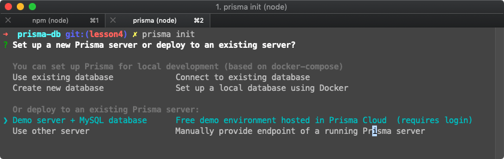
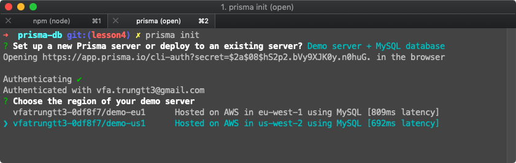
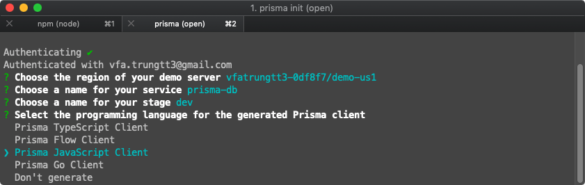
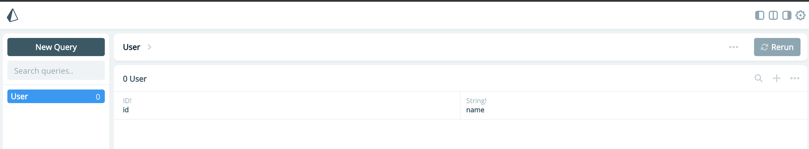
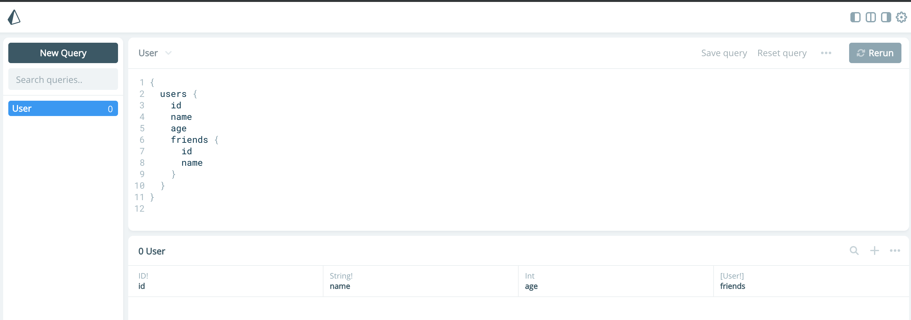

# #4: Database storage with Prisma

|   STT   | Nội Dung                                                                                                                                                                                                                                                                                                                                                                                                                                                                                                                                                                                                                                                                                      |
| :-----: | --------------------------------------------------------------------------------------------------------------------------------------------------------------------------------------------------------------------------------------------------------------------------------------------------------------------------------------------------------------------------------------------------------------------------------------------------------------------------------------------------------------------------------------------------------------------------------------------------------------------------------------------------------------------------------------------- |
|  **I**  | [Prisma là gì?](#what)                                                                                                                                                                                                                                                                                                                                                                                                                                                                                                                                                                                                                                                                        |
| **II**  | [Sử dụng Prisma như thế nào?](#how) <br>&emsp;&emsp;[1. Setup](#setup)<br>&emsp;&emsp;&emsp;&emsp;[a. Install the Prisma CLI](#cli)<br>&emsp;&emsp;&emsp;&emsp;[b. Khởi tạo Prisma](#init)<br>&emsp;&emsp;&emsp;&emsp;[c. Deploy Prisma](#deploy)<br><br>&emsp;&emsp;[2. Tích hợp vào GraphQL](#integrate)<br>&emsp;&emsp;&emsp;&emsp;[a. Update datamodel](#datamodel)<br>&emsp;&emsp;&emsp;&emsp;[b. Add Prisma vào context của GraphQL server](#context) <br>&emsp;&emsp;&emsp;&emsp;[c. Query với Prisma](#query)<br>&emsp;&emsp;&emsp;&emsp;[d. Mutation với Prisma](#mutation)<br>&emsp;&emsp;&emsp;&emsp;[e. Subscription với Prisma](#sub)<br><br>&emsp;&emsp;[3. Bài tập](#homework) |
| **III** | [Tại sao cần Prisma?](#why)                                                                                                                                                                                                                                                                                                                                                                                                                                                                                                                                                                                                                                                                   |

## I. Prisma là gì?<a id="what"></a>


> Về cơ bản: **Prisma** là một GraphQL **ORM** [(ORM là gì có thể tìm hiểu tại đây)](https://stackjava.com/uncategorized/orm-la-gi-tong-quan-ve-orm-framework.html).
> Là cây cầu kết nối giữa **database** và **resolver** function của GraphQL [(nếu quên resolver function là gì thì ôn lại bài tại đây)](https://github.com/vitalifyjp/vfa-workshop-graphql-apollo/tree/lesson2#2-resolver-)

> Prisma tuyên bố: "Prisma thay thế ORMs truyền thống!"

Để hiện thực lời tuyên bố của mình, Prisma đưa ra 6 tính năng nổi bật,

chúng ta hãy cùng xem: (Typescript nha bà con :))

1. Query DB: ([Xem kỹ hơn tại đây](https://www.prisma.io/client/client-typescript/))

   ```Typescript
   // Retrieve all users
   const allUsers: User[] = await prisma.users();

   // Retrieve a single user by email
   const bob: User = await prisma.users({email: 'bob@prisma.io'});

   // Retrieve all comments of a post in a single request
   const commentsOfPost: Comment[] = await prisma
     .post({id: 'cjl4srkaqqxa30b46pqcyzpyo'})
     .comments();
   ```

1. Filtering và Sorting: ([Xem kỹ hơn tại đây](https://www.prisma.io/client/client-typescript/))

   ```Typescript
   // Fetch all published posts about GraphQL by authors with Prisma-email
   const posts: Post[] = await prisma.posts({
     where: {
       published: true,
       title_contains: "GraphQL"
       author: {
         email_ends_with: "@prisma.io"
       }
     },
     orderBy: "createdAt_ASC"
   })
   ```

1. Khai báo mới Transactions: ([Xem kỹ hơn tại đây](https://www.prisma.io/client/client-typescript/))

   ```Typescript
   // Create a new user with two posts
   const newUser: User = await prisma.createUser({
     email: "alice@prisma.io",
     posts: {
       create: [{
         title: "Join us for Prisma Day. June 19, Berlin!"
       }, {
         title: "Follow Prisma on Twitter"
       }]
     }
   })
   ```

1. Realtime (subscribe thay đổi của database): ([Xem kỹ hơn tại đây](https://www.prisma.io/client/client-typescript/))

   ```TypeScript
   // Notify when any users are created, updated or deleted
   const userAsyncIterator = prisma.$subscribe.user().node()
   for await (const newUser of userAsyncIterator) {
     console.log(`New user: ${newUser}`);
   }

   // Get about when Gmail users are deleted
   const userAsyncIterator = prisma.$subscribe.user({
     where: {
       mutation_in: ["DELETED"]
       email_ends_with: "@gmail.com"
     }
   }).node()
   ```

1. Native GraphQL Syntax: ([Xem kỹ hơn tại đây](https://www.prisma.io/client/client-typescript/))

   ```Typescript
   // Send a raw GraphQL query
   const graphQLResult: any = await prisma.$graphql(`
   query {
     posts {
       title
       author { name }
     }
   }
   `)

   // Use GraphQL fragments for field selection
   const posts: any = await prisma
     .posts()
     .$fragment(`
       fragment PostWithAuthorsAndComments on Post {
         title
         author { name }
         comments { text }
       }
     `)
   ```

1. Datamodel: ([Xem kỹ hơn tại đây](https://www.prisma.io/client/client-typescript/))

   ```Typescript
   # Define your datamodel using declarative SDL syntax
   type User {
     id: ID! @id
     email: String! @unique
     posts: [Post!]!
   }

   type Post {
     id: ID! @id
     createdAt: DateTime! @createdAt
     title: String!
     published: Boolean! @default(value: "false")
     author: User!
   }
   ```

:dart: Như vậy là bạn đã hiểu sơ sơ về Prisma, giờ cùng thực hành từng bước một nào :muscle:

---

## II. Hướng dẫn sử dụng Prisma: <a id="how"></a>

🌟 Để cho đơn giản và nhanh chóng, chúng ta sẽ sử dụng database demo của Prisma cung cấp (lưu trữ trên dịch vụ đám mây Prisma Clould) thay vì sử một database ở máy local.
⚠️ Lưu ý là Prisma có thể kết nối tới rất nhiều loại database khác nhau (mongodb, postgreSQL, mySQL...)

### 1. Setup: <a id="setup"></a>

#### a. Install the Prisma CLI:<a id="cli"></a>

Mở terminal là run dòng lệnh sau để cài đặt

```shell
 npm install -g prisma
```

#### b. Khởi tạo Prisma:<a id="init"></a>

Mở terminal ở thư mục `graphql-apollo-tutorial/bai-tap/server`
Chạy lần lượt các dòng lệnh sau

```shell
 mkdir prisma-db
 cd prisma-db
 prisma init
```

Sau khi chạy console hiện lên thông báo cho phép bạn lựa chọn cách deploy Prisma.

> Chọn dòng **Demo server**



Cửa sổ trình duyệt sẽ hiện lên và yêu cầu bạn đăng nhập.
Bạn có thể đăng ký mới, hoặc sử dụng cách đăng nhập bằng github.
Sau khi đăng nhập quay trở lại màn hình terminal là màn hình lựa chọn region: Chọn `us`.



Tiếp theo là màn hình:

- Chọn tên Service.

```
Choose a name for your service (prisma-db)
```

- Chọn stage.

```
Choose a name for your stage (dev)
```

- Cuối cùng là chọn programing language để generate Prisma client cho NodeJS => Chọn **Javascript**



#### c. Deploy: <a id="deploy"></a>

Với các dòng lệnh phía trên chúng ta đã tạo ra cấu hình cơ bản Prisma dựa trên host demo database. Tiếp theo chúng ta cần tiến hành deploy cấu hình này lên host demo database bằng cách chạy lệnh sau:

```shell
prisma deploy
```

Sau khi lệnh chạy xong. Màn hình terminal như thế này là thành công.

Truy cập vào đường link Prisma Admin trong terminal để xem kết quả.


---

### 2. Tích hợp vào GraphQL server của chúng ta.<a id="integrate"></a>

#### a. Update datamodel <a id="datamodel"></a>

- Update lại schema `User` trong file **prisma-db/datamodel.prisma**

```diff
type User {
  id: ID! @id
  name: String!
+ age: Int
+ friends: [User]
}
```

- Deploy lại Prisma

```
prisma deploy
```

Check lại tại trang Prisma Admin


- Bởi vì chúng ta vừa mới update lại datamodel của Prisma nên cần phải generate lại Prisma Client.

```
prisma generate
```

Hoặc có thể setup tại `prisma.yml` để auto generate khi deploy:

```yml
hooks:
  post-deploy:
    - prisma generate
```

#### b. Add Prisma vào context của GraphQL server <a id="context"></a>

- Update file `src/index.js`

```diff
    import { ApolloServer } from "apollo-server";
    import typeDefs from "./schema";
    import resolvers from "./resolvers";
+   import { prisma } from "../prisma-db/generated/prisma-client";


    const server = new ApolloServer({
        typeDefs,
        resolvers,
+       context: req => ({
+          prisma
+      })
+   });

server.listen().then(({ url }) => {
  console.log(`🚀  Server ready at ${url}`);
});
```

🌟**Context** là đối tượng được chia sẻ cho tất cả các hàm resolver của GraphQL. Context thường được dùng để chứa những thứ dùng chung cho tất cả các query, muation như: authentication, current user, database connect, datasource ...

- Chúng ta phải cài thêm thư viện Prisma cho GraphQL server
  Chạy lệnh để cài đặt

```shell
npm install --save prisma-client-lib
```

#### c. Query với Prisma <a id="query"></a>

- Ở các bài trước, chúng ta sử dụng một mảng local nằm trong file để chứa dữ liệu. Lần này chúng ta sẽ update lại các hàm resolver để tương tác thực sự với demo database bằng Prisma
  <br>

- Update lại query **users** trong file `src/resolver.js`

```diff
const resolvers = {
    Query: {
-       users: (root, args, context, info) => users
+       users: (root, args, context, info) => {
+           return context.prisma.users();
+       }
    },
```

#### d. Mutation với Prisma <a id="mutation"></a>

- Update lại query **createUser** trong file `src/resolver.js`

```diff
const resolvers = {
  Query: {
    users: (root, args, context, info) => users
  },
  Mutation: {
    createUser: (root, args, context, info) => {
-     // Tạo mới User
-     let newUser = {
-       id: users.length + 1,
-       ...args.input
-     };
-     // Thêm vào mảng User
-     users.push(newUser);
-     pubsub.publish('CREATE_USER', { createUser: newUser });
-     return newUser;
+     return context.prisma
+       .createUser({
+         ...args.input
+       })
+       .then(newUser => {
+         pubsub.publish(`CREATE_USER`, {
+           createUser: newUser
+         });
+         return newUser;
+       });
   }

```

🌟 Bạn có thể thấy, dựa vào datamodel chúng ta khai báo trong file `datamodel.prisma` Prisma khởi tạo cho chúng ta những hàm CRUD để sử dụng ví dụ: _createUser_, _updateUser_...

<br/>

- Start server và test lại mutation createUser
  - Thử request mutation createUser
  - Check dữ liệu trên demo database bằng trang Prisma Admin

#### e. Subscription với Prisma <a id="sub"></a>

- Bạn có thể thấy với ví dụ của mutation ở trên, chúng ta có thể sử dụng subscription trong Prisma bằng cách gọi hàm `pubsub.publish` trong method `then()` để gửi notification cho subscription đang lắng nghe. Như cách bình thường ở bài trước [(quên thì xem tại đây)](https://github.com/vitalifyjp/vfa-workshop-graphql-apollo/tree/lesson3#subscription)
  <br>
- 🍎 Ngoài ra Prisma còn cung cấp cho chúng ta một cách khác để sử dụng Subscription. Là sử dụng `$subscribe`._tên_model_ Với cách này chúng ta không cần mutation phải gọi hàm `pubsub.publish` để gửi notification nữa. Ví dụ:

  ```javascript
  // Thông báo khi tạo mới User
  createUser: {
      subscribe: (root, args, context, info) => {
          return context.prisma.$subscribe.user().node();
      },
      resolve: (payload, args, context, info) => {
          return payload;
      }
  }
  // Thông báo khi Update/Delete User với điều kiện age > 20
  updateUser: {
      subscribe: (root, args, context, info) => {
          return context.prisma.$subscribe.user({
              where: {
                  mutation_in: ["DELETED", "UPDATED"]
                  age_gt: 20
              }
          }).node();
      },
      resolve: (payload, args, context, info) => {
          return payload;
      }
  }
  ```

#### ⚠️ Phần Subscription này mang tính chất nâng cao, mục đích chỉ để bạn biết được Prisma có hỗ trợ Subscription rất tốt. Bạn vẫn có thể sử dụng Subscription theo kiểu cũ:

- `subscription` lắng nghe event.
- `mutation` gửi notification cho subscription.

---

### 3. Bài tập <a id="homework"></a>

- Sử dụng Prisma để viết lại mutation updateUser và deleteUser
  Có thể tham khảo các hàm của Prisma [tại đây](https://github.com/prisma/rfcs/blob/new-ts-client-rfc/text/0000-new-ts-client.md#basic-queries)

---

## III. Tại sao nên sử dụng? <a id="why"></a>

1. Simple database workflows

1. A realtime layer for your database

1. End-to-end type safety

1. Clean and layered architecture

Sau khi thực hành và đọc đến đây,

nếu bạn chưa hiểu tại sao nên sử dụng Prisma, xin hãy tham khảo thêm [tại đây! :muscle:](https://www.prisma.io/docs/understand-prisma/prisma-introduction-what-why-how-j9ff/#why-use-prisma)

:apple: Happy coding!
