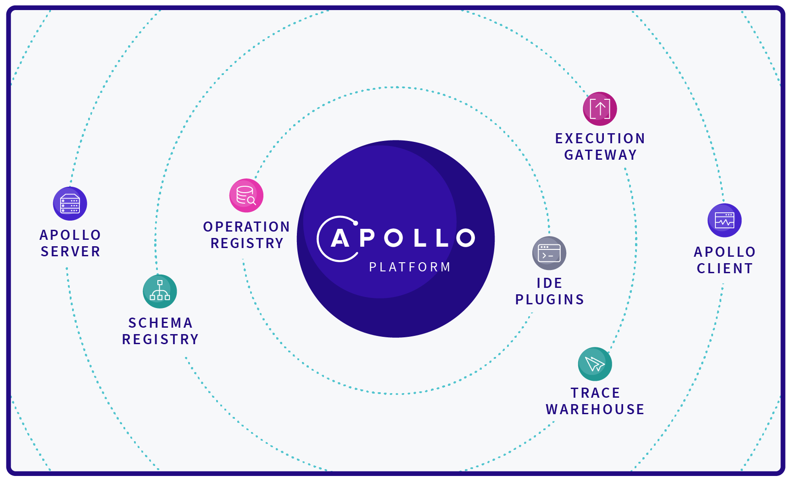
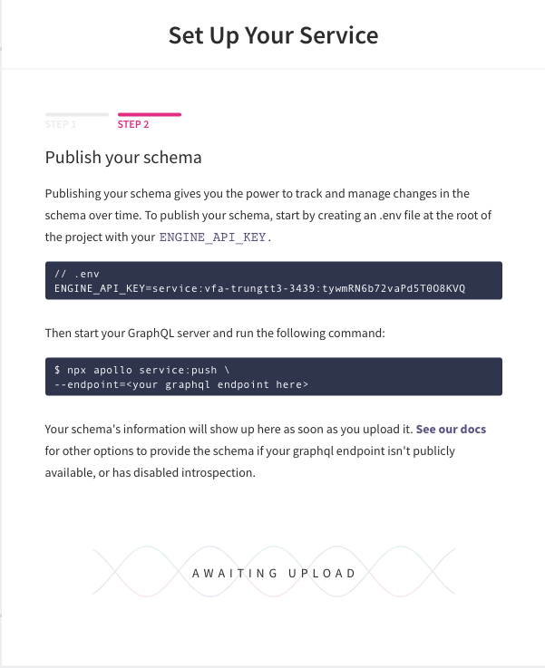
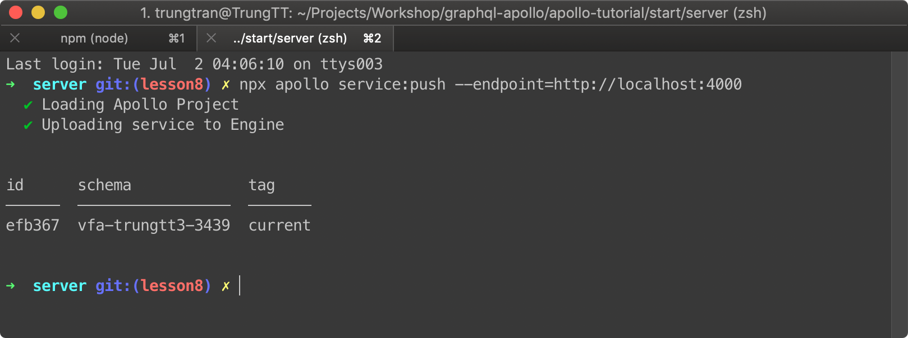
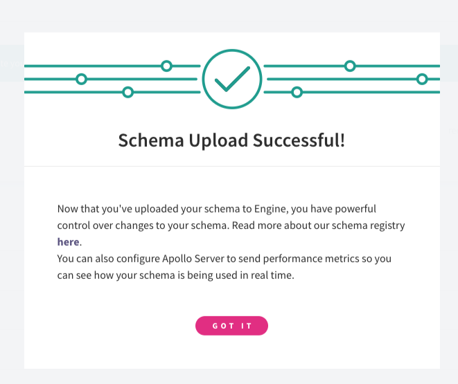
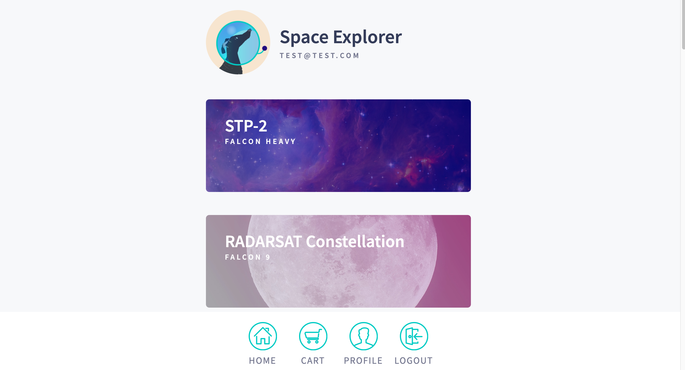

# Table of contents

- [Apollo Là Gì?](#1)
- [Thực hành thôi.](#2)

  - [1. Chuẩn bị](#2.1)
    <br/>
  - [2. Bắt đầu với Server](#2.2)

    - [a. Build Schema](#2.2.1)
    - [b. Kết nối với nguồn dữ liệu (data source)](#2.2.2)
    - [c. Viết Query Resolver](#2.c)
    - [d. Viết Mutation Resolver](#2.d)
    - [e. Chạy Server trên Production](#2.e)
      <br/>

  - [3. Tiếp theo là Client](#3)

    - [a. Setup](#3a)
    - [b. Khởi tạo Apollo Client](#3b)
    - [c. Lấy dữ liệu với Query](#3c)
    - [d. Update dữ liệu với Mutation](#3d)
    - [e. Apollo Cache](#3e)
      <br/>

  - [4. Testing](#4)

- [Summary](#Summary)

---

### I. Apollo Là Gì? <a id="1"></a>



##### Nói về GraphQL thì không thể không đề cập tới Apollo. Vậy Apollo là gì?

Bạn có thể hiểu về Apollo GraphQL đơn giản như sau:

> Apollo GraphQL là một platform dùng để quản lý data từ clould tới UI của bạn. Apollo bao gồm hai thư viện open-source chính dành cho server và client (**apollo-server và apollo-client**) ngoài ra còn có các công cụ khác dùng để hỗ trợ cho dev.

<hr/>

### II. Thực hành thôi. 💪<a id="2"></a>

Trong hướng dẫn này, chúng ta sẽ xây dựng một ứng dụng tương tác để đặt chỗ của bạn trong lần ra mắt Space-X sắp tới. Bạn có thể nghĩ về nó như một Grab-Ship cho du hành không gian! Tất cả dữ liệu là có thật, nhờ vào [SpaceX-API](https://github.com/r-spacex/SpaceX-API). <a id="spacex"></a>

🤝 _Nguồn bài hướng dẫn này được lấy từ trang chủ của apollo. [Bạn có thể xem trực tiếp tại đây](https://www.apollographql.com/docs/tutorial/introduction/)_

#### 1. Chuẩn bị: <a id="2.1"></a>

- Apollo Engine: Là **Clould Service** của Apollo nơi chúng ta đăng ký và quản lý các GraphQL API. Bạn hãy truy cập và đăng ký [ở đây](https://engine.apollographql.com/). Và tạm thời để đó sau khi hoàn thành, chúng ta sẽ quay lại với nó sau.

<br/>

- Client của chúng ta ở phần này sẽ dùng react. Nên yêu cầu là bạn đã có những kiến thức cơ bản của react. [Xem thêm về react tại đây](https://reactjs.org/tutorial/tutorial.html)

<br/>

- Cùng xem qua về cấu trúc thư mục của Source code (apollo-tutorial) thực hành của chúng ta nhé:
  - start: thư mục dùng để thực hành
  - final: thư mục kết quả cuối cùng dùng để tham khảo.
  - 2 thư mục trên đều chứa 2 phần là server và client với công dụng tương ứng.

<br/>

#### 2. Bắt đầu với Server trước nhé: <a id="2.2"></a>

##### 🍎 a. Đầu tiên là Build schema <a id="2.2.1"></a>

- **Step 1: Cài đặt NPM package**

  ```shell
  cd apollo-tutorial/start/server && npm install
  ```

- **Step 2: Khởi tạo Server**
  Vào file `server/src/index.js` tạo một GraphQL server bằng Apollo Server. Giống như các bài trước chúng ta đã làm. Nếu quên thì click vào bên dưới để xem code mẫu nhé.

  <details><summary>👉 Click vào đây để xem code mẫu nếu quên 😆</summary>

  ```javascript
  // Import thư viện apollo-server
  const { ApolloServer } = require('apollo-server');
  const typeDefs = require('./schema');

  const server = new ApolloServer({ typeDefs });

  server.listen().then(({ url }) => {
    console.log(`🚀 Server ready at ${url}`);
  });
  ```

  </details>

<br/>

- **Step 3: Bắt đầu viết Schema thôi**

  Đầu tiên chúng ta hãy nghĩ về dữ liệu chúng ta cần cho ứng dụng này trước đã:

  - Lấy tất cả dữ liệu về các chuyến phóng tên lửa sắp tới.
  - Lấy dữ liệu về chuyến phóng thông qua ID
  - Đăng nhập
  - Book 1 chuyến bay vào không gian chơi _(Yêu cầu đăng nhập)_
  - Hủy chuyến bay nếu sợ không dám đi. _(Yêu cầu đăng nhập)_

    <br/>

  Update file `server/src/schema.js`

  ```javascript
  const { gql } = require('apollo-server');

  const typeDefs = gql`
    type Query {
      # Lấy tất cả dữ liệu về các chuyến phóng tên lửa sắp tới
      launches: [Launch]!

      # Lấy dữ liệu về chuyến phóng thông qua ID
      launch(id: ID!): Launch

      # Queries for the current user
      me: User
    }

    type Mutation {
      # if false, booking trips failed -- check errors
      bookTrips(launchIds: [ID]!): TripUpdateResponse!

      # if false, cancellation failed -- check errors
      cancelTrip(launchId: ID!): TripUpdateResponse!

      login(email: String): String # login token
    }

    type Launch {
      id: ID!
      site: String
      mission: Mission
      rocket: Rocket
      isBooked: Boolean!
    }
    type Rocket {
      id: ID!
      name: String
      type: String
    }

    type User {
      id: ID!
      email: String!
      trips: [Launch]!
    }

    type Mission {
      name: String
      missionPatch(size: PatchSize): String
    }

    enum PatchSize {
      SMALL
      LARGE
    }

    type TripUpdateResponse {
      success: Boolean!
      message: String
      launches: [Launch]
    }
  `;

  module.exports = typeDefs;
  ```

<br/>

##### 🍎 Tiếp theo chúng ta sẽ kết nối với nguồn dữ liệu (data source) <a id="2.2.2"></a>

Như đề cập [1. Thực hành thôi](#spacex) chúng ta sẽ sử dụng dữ liệu thật ở [SpaceX-API](https://github.com/r-spacex/SpaceX-API)

- **Step 1: Cài đặt apollo-datasource-rest package:**

  ```shell
  npm install apollo-datasource-rest --save
  ```

  Note: thư mục ban đang đứng vẫn là start/server nhé

- **Step 2: Sử dụng apollo-datasource-rest package để connect tới SpaceX API:**

  Update file `src/datasources/launch.js` như sau:

  ```javascript
  const { RESTDataSource } = require('apollo-datasource-rest');

  class LaunchAPI extends RESTDataSource {
    constructor() {
      super();
      this.baseURL = 'https://api.spacexdata.com/v2/';
    }

    // leaving this inside the class to make the class easier to test
    launchReducer(launch) {
      return {
        id: launch.flight_number || 0,
        cursor: `${launch.launch_date_unix}`,
        site: launch.launch_site && launch.launch_site.site_name,
        mission: {
          name: launch.mission_name,
          missionPatchSmall: launch.links.mission_patch_small,
          missionPatchLarge: launch.links.mission_patch,
        },
        rocket: {
          id: launch.rocket.rocket_id,
          name: launch.rocket.rocket_name,
          type: launch.rocket.rocket_type,
        },
      };
    }

    async getAllLaunches() {
      const response = await this.get('launches');

      // transform the raw launches to a more friendly
      return Array.isArray(response) ? response.map((launch) => this.launchReducer(launch)) : [];
    }

    async getLaunchById({ launchId }) {
      const res = await this.get('launches', { flight_number: launchId });
      return this.launchReducer(res[0]);
    }

    async getLaunchesByIds({ launchIds }) {
      return Promise.all(launchIds.map((launchId) => this.getLaunchById({ launchId })));
    }
  }

  module.exports = LaunchAPI;
  ```

  <br/>

- **Step 3: Tạo Custom Data source cho SQL**

  REST API của chúng ta hiện giờ chỉ là Read-only. Chúng ta cần connect tới DB để lưu trữ và lấy dữ liệu User. Chúng ta sẽ sử dụng **SQLite** cho db và **Sequelize** cho ORM. (2 package này đã được cài đặt sẳn trong package.json)

  Hiện tại Apollo Server vẫn chưa hỗ trợ SQL data source. Vì thế chúng ta cần tạo một custom data source.

  Update file src/index.js

  ```diff
  const { ApolloServer } = require('apollo-server');
  const typeDefs = require('./schema');
  + const { createStore } = require('./utils');

  + const LaunchAPI = require('./datasources/launch');
  + const UserAPI = require('./datasources/user');

  + const store = createStore();

  const server = new ApolloServer({
    typeDefs,
  + dataSources: () => ({
  +   launchAPI: new LaunchAPI(),
  +   userAPI: new UserAPI({ store })
  + })
  });

  server.listen().then(({ url }) => {
    console.log(`🚀 Server ready at ${url}`);
  });
  ```

  Giải thích đoạn code bên trên:
  `createStore`: function dùng để setup database.(Vì WorkShop này vẫn là về GraphQL nên chúng ta sẽ không đào sâu phần này.)
  `LaunchAPI` và `UserAPI` là hai data source của chúng ta.

  <br/>

##### 🍎 c. Viết Query Resolver <a id="2.c"></a>

- **Step 1: Add Resolver vào Server**

  Update file `src/index.js`

  ```diff
  const { ApolloServer } = require('apollo-server');
  const typeDefs = require('./schema');
  const { createStore } = require('./utils');
  + const resolvers = require('./resolvers');

  const LaunchAPI = require('./datasources/launch');
  const UserAPI = require('./datasources/user');

  const store = createStore();

  const server = new ApolloServer({
    typeDefs,
  + resolvers,
    dataSources: () => ({
      launchAPI: new LaunchAPI(),
      userAPI: new UserAPI({ store })
    })
  });

  server.listen().then(({ url }) => {
    console.log(`🚀 Server ready at ${url}`);
  });
  ```

- **Step 2: Viết Query resolvers**

  Update file `src/resolver.js`

  ```javascript
  module.exports = {
    Query: {
      launches: (root, args, { dataSources }) => dataSources.launchAPI.getAllLaunches(),
      launch: (root, { id }, { dataSources }) =>
        dataSources.launchAPI.getLaunchById({ launchId: id }),
      me: (root, args, { dataSources }) => dataSources.userAPI.findOrCreateUser(),
    },
  };
  ```

  Bạn có thể thấy khác với các lesson trước. Chúng ta không truy vấn trực tiếp đến DB ở resolver mà gọi hàm thông qua datasource. Từ đó data source sẽ quyết định truy vấn tới REST API khác (dataSources.launchAPI) hay là query local DB (dataSources.userAPI).

- **Step 3: Pagination**

  Update type query trong file `src/schema.js`

  ```diff
  type Query {
    # Lấy tất cả dữ liệu về các chuyến phóng tên lửa sắp tới
  - launches: [Launch]!
  + launches( # replace the current launches query with this one.
  +   """
  +   The number of results to show. Must be >= 1. Default = 20
  +   """
  +   pageSize: Int
  +   """
  +   If you add a cursor here, it will only return results _after_ this cursor
  +   """
  +   after: String
  + ): LaunchConnection!

    # Lấy dữ liệu về chuyến phóng thông qua ID
    launch(id: ID!): Launch

    # Queries for the current user
    me: User
  }

  + """
  + Simple wrapper around our list of launches that contains a cursor to the
  + last item in the list. Pass this cursor to the launches query to fetch + results after these.
  + """
  + type LaunchConnection { # add this below the Query type as an additional type.
  +   cursor: String!
  +   hasMore: Boolean!
  +   launches: [Launch]!
  + }
  ```

  Update file `src/resolvers.js`

  ```diff
  + const { paginateResults } = require('./utils');

  module.exports = {
    Query: {
  -   launches: (root, args, { dataSources }) => dataSources.launchAPI.getAllLaunches(),
  +   launches: async (_, { pageSize = 20, after }, { dataSources }) => {
  +    const allLaunches = await dataSources.launchAPI.getAllLaunches();
  +     // we want these in reverse chronological order
  +     allLaunches.reverse();
  +     const launches = paginateResults({
  +       after,
  +       pageSize,
  +       results: allLaunches
  +     });
  +     return {
  +       launches,
  +       cursor: launches.length ? launches[launches.length - 1].cursor : null,
  +       // if the cursor of the end of the paginated results is the same as the
  +       // last item in _all_ results, then there are no more results after this
  +       hasMore: launches.length
  +         ? launches[launches.length - 1].cursor !==
  +           allLaunches[allLaunches.length - 1].cursor
  +         : false
  +     };
  +   },
      launch: (_, { id }, { dataSources }) =>
        dataSources.launchAPI.getLaunchById({ launchId: id }),
      me: async (_, __, { dataSources }) =>
        dataSources.userAPI.findOrCreateUser(),
    }
  };
  ```

- **Step 4: Add trực tiếp resolver cho type Launch and User**

  Một điều nữa bạn cần lưu ý là chúng ta có thể add trực tiếp resolver cho từng type không cần phải thông qua query và mutation.

  Update `src/resolvers.js` hai hàm dưới nằm ngoài query

  ```javascript
  Query: {...},
  Launch: {
    isBooked: async (launch, _, { dataSources }) =>
      dataSources.userAPI.isBookedOnLaunch({ launchId: launch.id }),
  },
  User: {
    trips: async (_, __, { dataSources }) => {
      // get ids of launches by user
      const launchIds = await dataSources.userAPI.getLaunchIdsByUser();

      if (!launchIds.length) return [];

      // look up those launches by their ids
      return (
        dataSources.launchAPI.getLaunchesByIds({
          launchIds,
        }) || []
      );
    },
  },
  ```

  <br/>

- **Step S2: Authentication**

  Update `src/index.js`

  ```diff
  const { ApolloServer } = require('apollo-server');
  const typeDefs = require('./schema');
  const { createStore } = require('./utils');
  const resolvers = require('./resolvers');
  + const isEmail = require('isemail');

  const LaunchAPI = require('./datasources/launch');
  const UserAPI = require('./datasources/user');

  const store = createStore();

  const server = new ApolloServer({
  + context: async ({ req }) => {
  +   // simple auth check on every request
  +   const auth = (req.headers && req.headers.authorization) || '';
  +   const email = Buffer.from(auth, 'base64').toString('ascii');
  +   // if the email isn't formatted validly, return null for user
  +   if (!isEmail.validate(email)) return { user: null };
  +   // find a user by their email
  +   const users = await store.users.findOrCreate({ where: { email } });
  +   const user = users && users[0] ? users[0] : null;

  +   return { user: { ...user.dataValues } };
  + },
    typeDefs,
    resolvers,
    dataSources: () => ({
      launchAPI: new LaunchAPI(),
      userAPI: new UserAPI({ store })
    })
  });

  server.listen().then(({ url }) => {
    console.log(`🚀 Server ready at ${url}`);
  });
  ```

##### 🍎 d. Viết Mutation Resolver <a id="2.d"></a>

Update file `src/resolvers.js` để thêm resolver cho mutation:

```javascript
Mutation: {
  bookTrips: async (_, { launchIds }, { dataSources }) => {
    const results = await dataSources.userAPI.bookTrips({ launchIds });
    const launches = await dataSources.launchAPI.getLaunchesByIds({
      launchIds,
    });

    return {
      success: results && results.length === launchIds.length,
      message:
        results.length === launchIds.length
          ? 'trips booked successfully'
          : `the following launches couldn't be booked: ${launchIds.filter(
              id => !results.includes(id),
            )}`,
      launches,
    };
  },
  cancelTrip: async (_, { launchId }, { dataSources }) => {
    const result = await dataSources.userAPI.cancelTrip({ launchId });

    if (!result)
      return {
        success: false,
        message: 'failed to cancel trip',
      };

    const launch = await dataSources.launchAPI.getLaunchById({ launchId });
    return {
      success: true,
      message: 'trip cancelled',
      launches: [launch],
    };
  },
  login: async (_, { email }, { dataSources }) => {
    const user = await dataSources.userAPI.findOrCreateUser({ email });
    if (user) return Buffer.from(email).toString('base64');
  }
},
```

<br/>

##### 🍎 e. Chạy Server trên Production <a id="2.e"></a>

Bạn còn nhớ Apollo Engine Chúng ta dùng đăng nhập [ở phần 1. Chuẩn bị](#2.1) chứ. Tạo mới 1 service trên Apollo Engine:
Khi tạo thành công sẽ có key như sau:



Copy key này lưu vào file `server/.env`

```
ENGINE_API_KEY=service:vfa-trungtt3-3439:tywmRN6b72vaPd5T0O8KVQ
```

Mở 1 tab terminal để start server

```
npm start
```

Và mở thêm 1 tab để publish schema lên engine

```
npx apollo service:push --endpoint=http://localhost:4000
```

Terminal



Và Engine hiện thông báo như thế này là thành công:



Bạn có thể truy cập vào phần explorer của Engine để xem Schema vừa mới đẩy lên.


<br/>

Thế là xong phần Server chúng ta sang Client thôi!

<br/>

#### 3. Apollo Client <a id="3"></a>

##### a. Setup <a id="3a"></a>

- Cài đặt NPM Package:

  ```
  cd start/client && npm install
  ```

- Setup **ENGINE_API_KEY** đã tạo ở step trên vào file .env

- Config Apollo trong file `apollo.config.js`

  ```javascript
  module.exports = {
    client: {
      name: 'Space Explorer [web]',
      service: 'space-explorer',
    },
  };
  ```

##### b. Khởi tạo Apollo Client:<a id="3b"></a>

- Update `src/index.js`

  ```javascript
  import { ApolloClient } from 'apollo-client';
  import { InMemoryCache } from 'apollo-cache-inmemory';
  import { HttpLink } from 'apollo-link-http';

  const cache = new InMemoryCache();
  const link = new HttpLink({
    uri: 'http://localhost:4000/',
  });

  const client = new ApolloClient({
    cache,
    link,
  });
  ```

  uri ở trên chính là endpoint của chúng ta đã deploy ở trên. Hiện tại chúng ta đang sử dụng server chạy ở local nên sẽ là http://localhost:4000/

- Connect Apollo Client với React:
  Update `src/index.js` dùng component **ApolloProvider** để kết nối như sau:

  ```diff
  + import React from 'react';
  + import ReactDOM from 'react-dom';

  import { ApolloClient } from "apollo-client";
  import { InMemoryCache } from "apollo-cache-inmemory";
  import { HttpLink } from "apollo-link-http";
  + import {Query, ApolloProvider} from 'react-apollo';
  + import gql from 'graphql-tag';

  + import Pages from './pages';
  + import Login from './pages/login';
  + import injectStyles from './styles';

  const cache = new InMemoryCache();
  const link = new HttpLink({
    uri: "http://localhost:4000/"
  });

  const client = new ApolloClient({
    cache,
    link
  });

  + injectStyles();
  + ReactDOM.render(
  +  <ApolloProvider client={client}>
  +    <Pages />
  +  </ApolloProvider>, document.getElementById('root')
  + );
  ```

##### c. Lấy dữ liệu với query <a id="3c"></a>

- **Lấy List dữ liệu:**

  Update file `src/pages/launches.js` dùng thẻ <**Query**> như sau:

  <details><summary>src/pages/launches.js</summary>

  ```javascript
  import React, { Fragment } from 'react';
  import { Query } from 'react-apollo';
  import gql from 'graphql-tag';

  import { LaunchTile, Header, Button, Loading } from '../components';

  export const LAUNCH_TILE_DATA = gql`
    fragment LaunchTile on Launch {
      __typename
      id
      isBooked
      rocket {
        id
        name
      }
      mission {
        name
        missionPatch
      }
    }
  `;

  export const GET_LAUNCHES = gql`
    query GetLaunchList($after: String) {
      launches(after: $after) {
        cursor
        hasMore
        launches {
          ...LaunchTile
        }
      }
    }
    ${LAUNCH_TILE_DATA}
  `;

  export default function Launches() {
    return (
      <Query query={GET_LAUNCHES}>
        {({ data, loading, error }) => {
          if (loading) return <Loading />;
          if (error) return <p>ERROR</p>;

          return (
            <Fragment>
              <Header />
              {data.launches &&
                data.launches.launches &&
                data.launches.launches.map((launch) => (
                  <LaunchTile key={launch.id} launch={launch} />
                ))}
            </Fragment>
          );
        }}
      </Query>
    );
  }
  ```

  </details>

  <br/>

- **Phân trang List dữ liệu:**

  Update file `src/pages/launches.js`

  <details><summary>src/pages/launches.js</summary>

  ```diff
  <Query query={GET_LAUNCHES}>
  -   {({ data, loading, error }) => {
  +   {({ data, loading, error, fetchMore }) => {
        if (loading) return <Loading />;
        if (error) return <p>ERROR</p>;

        return (
          <Fragment>
            <Header />
            {data.launches &&
              data.launches.launches &&
              data.launches.launches.map(launch => (
                <LaunchTile key={launch.id} launch={launch} />
              ))}

  +         {data.launches && data.launches.hasMore && (
  +           <Button
  +             onClick={() =>
  +               fetchMore({
  +                 variables: {
  +                   after: data.launches.cursor
  +                 },
  +                 updateQuery: (prev, { fetchMoreResult, ...rest }) => {
  +                   if (!fetchMoreResult) return prev;
  +                   return {
  +                     ...fetchMoreResult,
  +                     launches: {
  +                       ...fetchMoreResult.launches,
  +                       launches: [
  +                         ...prev.launches.launches,
  +                         ...fetchMoreResult.launches.launches
  +                       ]
  +                     }
  +                   };
  +                 }
  +               })
  +             }>
  +             Load More
  +           </Button>
  +         )}
          </Fragment>
        );
      }}
    </Query>
  ```

  </details>

  <br/>

- **Lấy dữ liệu của 1 lần phóng:**

  Update file `src/pages/launch.js`

  <details><summary>src/pages/launch.js</summary>

  ```javascript
  import React, { Fragment } from 'react';
  import { Query } from 'react-apollo';
  import gql from 'graphql-tag';

  import Loading from '../components/loading';
  import Header from '../components/header';
  import ActionButton from '../containers/action-button';
  import LaunchDetail from '../components/launch-detail';

  import { LAUNCH_TILE_DATA } from './launches';

  export const GET_LAUNCH_DETAILS = gql`
    query LaunchDetails($launchId: ID!) {
      launch(id: $launchId) {
        site
        rocket {
          type
        }
        ...LaunchTile
      }
    }

    ${LAUNCH_TILE_DATA}
  `;

  export default function Launch({ launchId }) {
    return (
      <Query query={GET_LAUNCH_DETAILS} variables={{ launchId }}>
        {({ data, loading, error }) => {
          if (loading) return <Loading />;
          if (error) return <p>ERROR: {error.message}</p>;

          return (
            <Fragment>
              <Header image={data.launch.mission.missionPatch}>{data.launch.mission.name}</Header>
              <LaunchDetail {...data.launch} />
              <ActionButton {...data.launch} />
            </Fragment>
          );
        }}
      </Query>
    );
  }
  ```

  </details>

  <br/>

- **Lấy dữ liệu User**

  Update file `src/pages/profile.js`

  <details><summary>src/pages/profile.js</summary>

  ```javascript
  import React, { Fragment } from 'react';
  import { Query } from 'react-apollo';
  import gql from 'graphql-tag';

  import { Loading, Header, LaunchTile } from '../components';
  import { LAUNCH_TILE_DATA } from './launches';

  const GET_MY_TRIPS = gql`
    query GetMyTrips {
      me {
        id
        email
        trips {
          ...LaunchTile
        }
      }
    }
    ${LAUNCH_TILE_DATA}
  `;

  export default function Profile() {
    return (
      <Query query={GET_MY_TRIPS} fetchPolicy="network-only">
        {({ data, loading, error }) => {
          if (loading) return <Loading />;
          if (error) return <p>ERROR: {error.message}</p>;

          return (
            <Fragment>
              <Header>My Trips</Header>
              {data.me && data.me.trips.length ? (
                data.me.trips.map((launch) => <LaunchTile key={launch.id} launch={launch} />)
              ) : (
                <p>You haven't booked any trips</p>
              )}
            </Fragment>
          );
        }}
      </Query>
    );
  }
  ```

  </details>

  <br/>

##### d. Update dữ liệu với Mutation <a id="3d"></a>

- **Login**

  Update file `src/pages/login.js`

  <details><summary>src/pages/login.js</summary>

  ```javascript
  import React from 'react';
  import { Mutation, ApolloConsumer } from 'react-apollo';
  import gql from 'graphql-tag';

  import { LoginForm, Loading } from '../components';

  const LOGIN_USER = gql`
    mutation login($email: String!) {
      login(email: $email)
    }
  `;

  export default function Login() {
    return (
      <ApolloConsumer>
        {(client) => (
          <Mutation
            mutation={LOGIN_USER}
            onCompleted={({ login }) => {
              localStorage.setItem('token', login);
              client.writeData({ data: { isLoggedIn: true } });
            }}
          >
            {(login, { loading, error }) => {
              // this loading state will probably never show, but it's helpful to
              // have for testing
              if (loading) return <Loading />;
              if (error) return <p>An error occurred</p>;

              return <LoginForm login={login} />;
            }}
          </Mutation>
        )}
      </ApolloConsumer>
    );
  }
  ```

  </details>

  <br/>

  ApolloConsumer là component dùng để access vào ApolloClient.
  Hàm onCompleted cho phép chúng ta khi login thành công sẽ lưu trữ token vào localStorage.

- **Authentication với token vừa nhận**

  Update file `src/index.js`

  <details><summary>src/index.js</summary>

  ```diff
  const link = new HttpLink({
    uri: "http://localhost:4000/",
  + headers: {
  +   authorization: localStorage.getItem('token'),
  + },
  });

  const client = new ApolloClient({
    cache,
    link
  });

  ```

  </details>

  <br/>

##### e. Xử lý local data với Apollo Cache <a id="3e"></a>

- **Viết local Schema (Schema ở client)**

  Update file `src/resolvers.js`

  <details><summary>src/resolvers.js</summary>

  ```javascript
  import gql from 'graphql-tag';

  export const typeDefs = gql`
    extend type Query {
      isLoggedIn: Boolean!
      cartItems: [ID!]!
    }

    extend type Launch {
      isInCart: Boolean!
    }

    extend type Mutation {
      addOrRemoveFromCart(id: ID!): [Launch]
    }
  `;

  export const resolvers = {};
  ```

  </details>

  <br/>

  Update lại file `src/index.js` để thêm resolver và typeDefs

  <details><summary>src/index.js</summary>

  ```diff
    import Login from './pages/login';
  + import {resolvers, typeDefs} from './resolvers';
    import injectStyles from './styles';

  const link = new HttpLink({
    uri: "http://localhost:4000/",
    headers: {
      authorization: localStorage.getItem("token")
    }
  });

  const client = new ApolloClient({
    cache,
    link,
  + typeDefs,
  + resolvers
  });

  + cache.writeData({
  +   data: {
  +     isLoggedIn: !!localStorage.getItem('token'),
  +     cartItems: [],
  +   },
  + });
  ```

  </details>

  <br/>

- **Dùng Query Local Data để check Login.**

  Update `src/index.js` nếu chưa login thì điều hướng về trang login.
  `@client` là client direct để nhận biết Query Local

  <details><summary>src/index.js</summary>

  ```diff
  + const IS_LOGGED_IN = gql`
  + query IsUserLoggedIn {
  +   isLoggedIn @client
  + }
  + `;

  injectStyles();
  ReactDOM.render(
    <ApolloProvider client={client}>
  -   <Pages />
  +   <Query query={IS_LOGGED_IN}>
  +     {({ data }) => (data.isLoggedIn ? <Pages /> : <Login />)}
  +   </Query>
    </ApolloProvider>,
    document.getElementById('root'),
  );
  ```

  </details>

  <br/>

  Update file `src/pages/cart.js`

  <details><summary>src/pages/cart.js</summary>

  ```javascript
  import React, { Fragment } from 'react';
  import { Query } from 'react-apollo';
  import gql from 'graphql-tag';

  import { Header, Loading } from '../components';
  import { CartItem, BookTrips } from '../containers';

  export const GET_CART_ITEMS = gql`
    query GetCartItems {
      cartItems @client
    }
  `;

  export default function Cart() {
    return (
      <Query query={GET_CART_ITEMS}>
        {({ data, loading, error }) => {
          if (loading) return <Loading />;
          if (error) return <p>ERROR: {error.message}</p>;
          return (
            <Fragment>
              <Header>My Cart</Header>
              {!data.cartItems || !data.cartItems.length ? (
                <p data-testid="empty-message">No items in your cart</p>
              ) : (
                <Fragment>
                  {data.cartItems.map((launchId) => (
                    <CartItem key={launchId} launchId={launchId} />
                  ))}
                  <BookTrips cartItems={data.cartItems} />
                </Fragment>
              )}
            </Fragment>
          );
        }}
      </Query>
    );
  }
  ```

  </details>

  <br/>

  Update file `src/containers/cart-item.js`

    <details><summary>src/containers/cart-item.js</summary>

  ```javascript
  import React from 'react';
  import { Query } from 'react-apollo';
  import gql from 'graphql-tag';

  import LaunchTile from '../components/launch-tile';
  import { LAUNCH_TILE_DATA } from '../pages/launches';

  export const GET_LAUNCH = gql`
    query GetLaunch($launchId: ID!) {
      launch(id: $launchId) {
        ...LaunchTile
      }
    }
    ${LAUNCH_TILE_DATA}
  `;

  export default function CartItem({ launchId }) {
    return (
      <Query query={GET_LAUNCH} variables={{ launchId }}>
        {({ data, loading, error }) => {
          if (loading) return <p>Loading...</p>;
          if (error) return <p>ERROR: {error.message}</p>;
          return data && <LaunchTile launch={data.launch} />;
        }}
      </Query>
    );
  }
  ```

  </details>

  <br/>

  Update file `src/resolvers.js`

  <details><summary>src/resolvers.js</summary>

  ```diff
  - export const resolvers = {};
  + export const resolvers = {
  +   Launch: {
  +     isInCart: (launch, _, { cache }) => {
  +       const { cartItems } = cache.readQuery({ query: GET_CART_ITEMS });
  +       return cartItems.includes(launch.id);
  +     },
  +   },
  + };
  ```

  </details>

  <br/>

  Update file `src/pages/launch.js`

  <details><summary>src/pages/launch.js</summary>

  ```diff
  export const GET_LAUNCH_DETAILS = gql`
    query LaunchDetails($launchId: ID!) {
      launch(id: $launchId) {
  +     isInCart @client
        site
        rocket {
          type
        }
        ...LaunchTile
      }
    }
    ${LAUNCH_TILE_DATA}
  `;
  ```

  </details>

  <br/>

- **Update local data:**

  Update file `src/containers/logout-button.js`
  Clear localStorage khi logout

  <details><summary>src/containers/logout-button.js</summary>

  ```javascript
  import React from 'react';
  import styled from 'react-emotion';
  import { ApolloConsumer } from 'react-apollo';

  import { menuItemClassName } from '../components/menu-item';
  import { ReactComponent as ExitIcon } from '../assets/icons/exit.svg';

  export default function LogoutButton() {
    return (
      <ApolloConsumer>
        {(client) => (
          <StyledButton
            onClick={() => {
              client.writeData({ data: { isLoggedIn: false } });
              localStorage.clear();
            }}
          >
            <ExitIcon />
            Logout
          </StyledButton>
        )}
      </ApolloConsumer>
    );
  }

  const StyledButton = styled('button')(menuItemClassName, {
    background: 'none',
    border: 'none',
    padding: 0,
  });
  ```

  </details>

  <br/>

  Update file `src/containers/book-trips.js`
  Dùng mutation để update data

  <details><summary>src/containers/book-trips.js</summary>

  ```javascript
  import React from 'react';
  import { Mutation } from 'react-apollo';
  import gql from 'graphql-tag';

  import Button from '../components/button';
  import { GET_LAUNCH } from './cart-item';

  const BOOK_TRIPS = gql`
    mutation BookTrips($launchIds: [ID]!) {
      bookTrips(launchIds: $launchIds) {
        success
        message
        launches {
          id
          isBooked
        }
      }
    }
  `;

  export default function BookTrips({ cartItems }) {
    return (
      <Mutation
        mutation={BOOK_TRIPS}
        variables={{ launchIds: cartItems }}
        refetchQueries={cartItems.map((launchId) => ({
          query: GET_LAUNCH,
          variables: { launchId },
        }))}
        update={(cache) => {
          cache.writeData({ data: { cartItems: [] } });
        }}
      >
        {(bookTrips, { data, loading, error }) =>
          data && data.bookTrips && !data.bookTrips.success ? (
            <p data-testid="message">{data.bookTrips.message}</p>
          ) : (
            <Button onClick={bookTrips} data-testid="book-button">
              Book All
            </Button>
          )
        }
      </Mutation>
    );
  }
  ```

  </details>

  <br/>

- **Viết Local Resolver**

  Update file `src/resolvers.js` để thêm resolver cho addOrRemoveFromCart

  <details><summary>src/resolvers.js</summary>

  ```diff
  + import { GET_CART_ITEMS } from './pages/cart';

  export const resolvers = {
    Launch: {
      isInCart: (launch, _, { cache }) => {
        const { cartItems } = cache.readQuery({ query: GET_CART_ITEMS });
        return cartItems.includes(launch.id);
      }
    },
  + Mutation: {
  +   addOrRemoveFromCart: (_, { id }, { cache }) => {
  +     const { cartItems } = cache.readQuery({ query: GET_CART_ITEMS });
  +     const data = {
  +       cartItems: cartItems.includes(id)
  +         ? cartItems.filter(i => i !== id)
  +         : [...cartItems, id]
  +     };
  +     cache.writeQuery({ query: GET_CART_ITEMS, data });
  +     return data.cartItems;
  +   }
  + }
  };
  ```

  </details>

  <br/>

  Update file `src/containers/action-button.js`

  <details><summary>src/containers/action-button.js</summary>

  ```javascript
  import React from 'react';
  import { Mutation } from 'react-apollo';
  import gql from 'graphql-tag';

  import { GET_LAUNCH_DETAILS } from '../pages/launch';
  import Button from '../components/button';

  const TOGGLE_CART = gql`
    mutation addOrRemoveFromCart($launchId: ID!) {
      addOrRemoveFromCart(id: $launchId) @client
    }
  `;

  const CANCEL_TRIP = gql`
    mutation cancel($launchId: ID!) {
      cancelTrip(launchId: $launchId) {
        success
        message
        launches {
          id
          isBooked
        }
      }
    }
  `;

  export default function ActionButton({ isBooked, id, isInCart }) {
    return (
      <Mutation
        mutation={isBooked ? CANCEL_TRIP : TOGGLE_CART}
        variables={{ launchId: id }}
        refetchQueries={[
          {
            query: GET_LAUNCH_DETAILS,
            variables: { launchId: id },
          },
        ]}
      >
        {(mutate, { loading, error }) => {
          if (loading) return <p>Loading...</p>;
          if (error) return <p>An error occurred</p>;

          return (
            <div>
              <Button onClick={mutate} isBooked={isBooked} data-testid={'action-button'}>
                {isBooked ? 'Cancel This Trip' : isInCart ? 'Remove from Cart' : 'Add to Cart'}
              </Button>
            </div>
          );
        }}
      </Mutation>
    );
  }
  ```

  </details>

  <br/>

#### 4. Testing <a id="4"></a>

- Start server

```
cd start/server && npm start
```

- Start client

```
cd start/client && npm start
```

Truy cập http://localhost:3000/ và test lại thành quả.

Như hình bên dưới là thành công 🎉


<br/>



<hr/>

### Summary <a id="Summary"> </a>

Workshop về GraphQL và Apollo đến đây là kết thúc.
Hy vọng qua sau khi kết thúc 8 lesson các bạn đã có thể làm việc ngon lành với GraphQL.

Cheers 🥂
