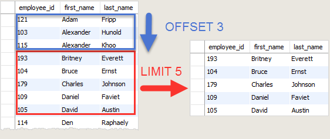
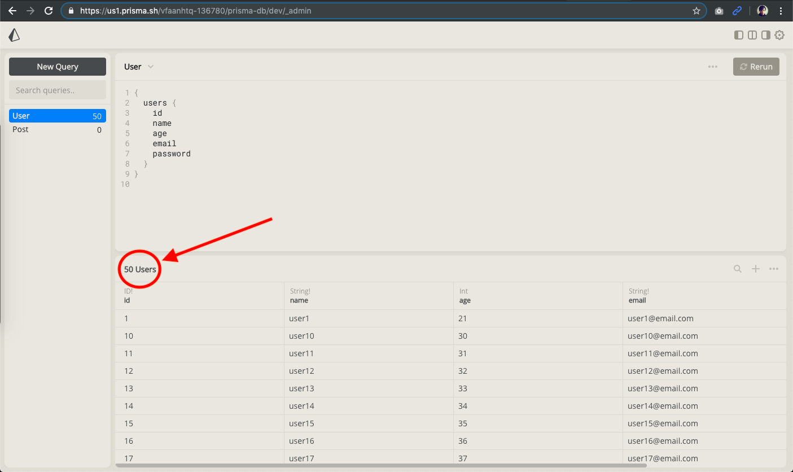
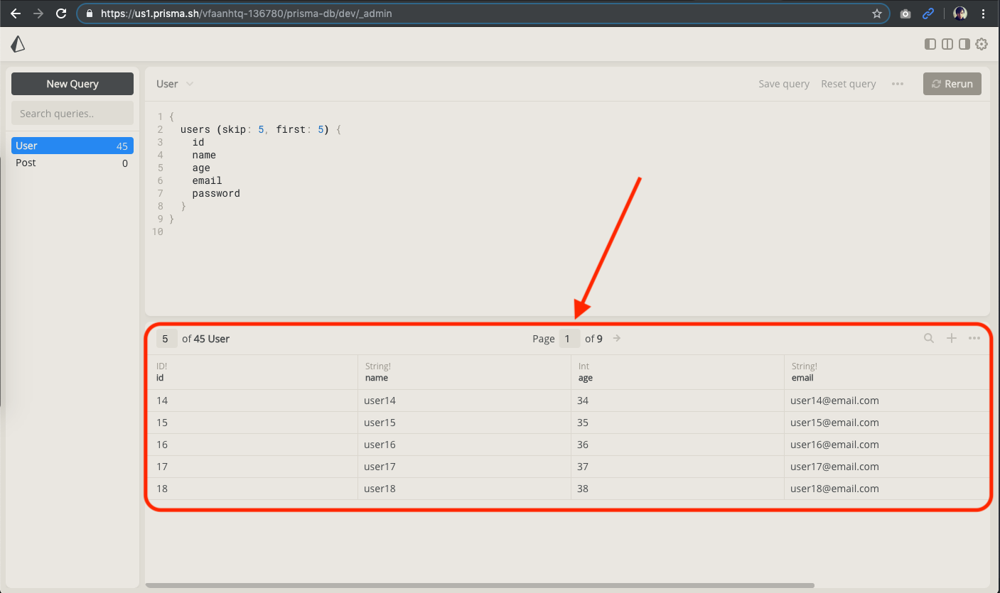
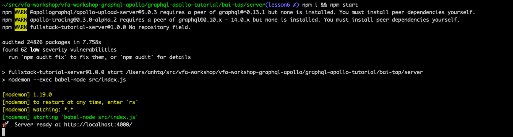
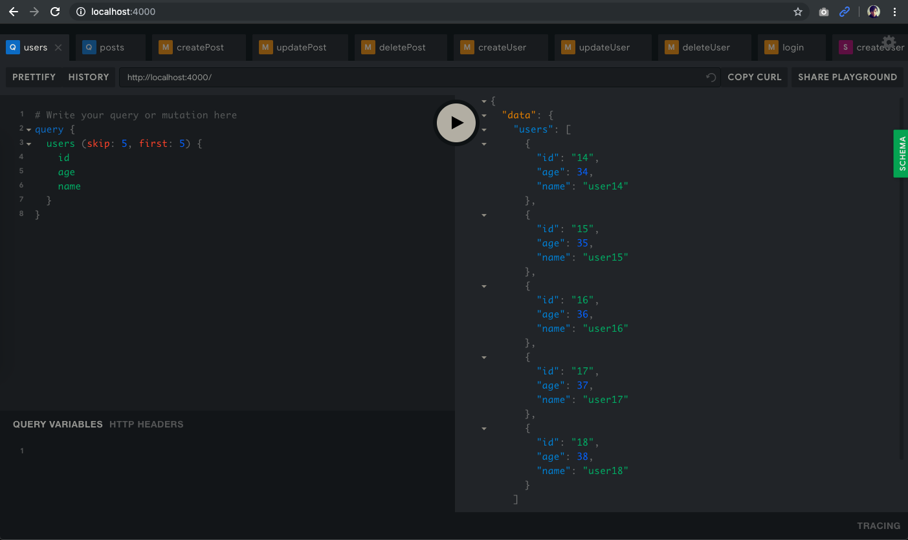
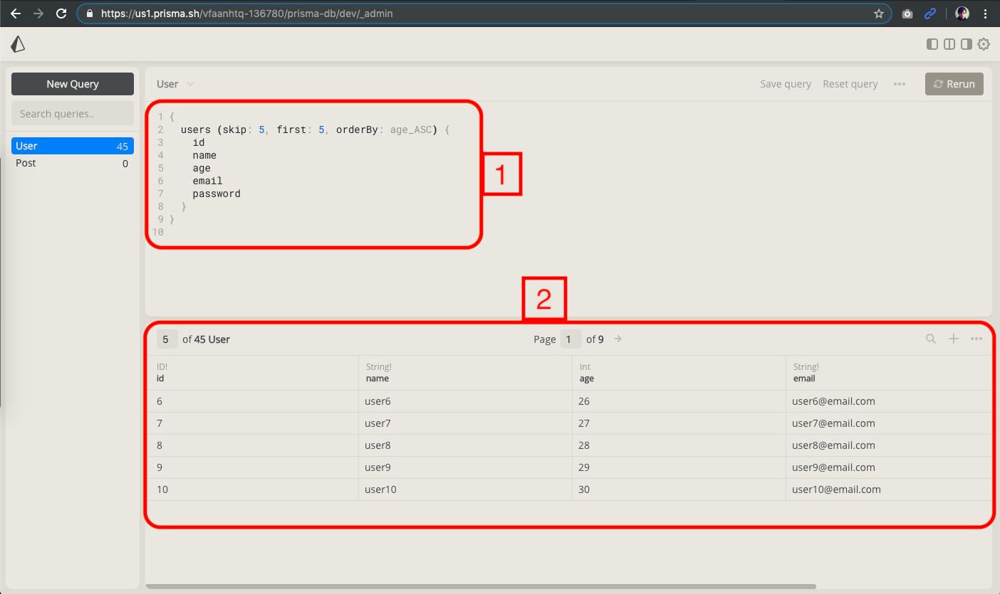
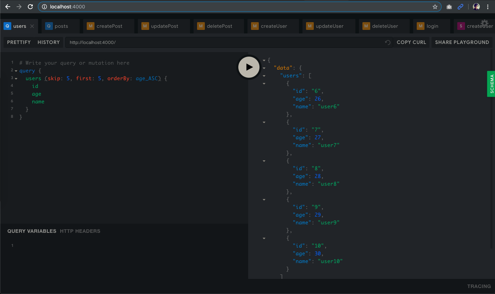

# Table of contents

- [Pagination](#page)
- [Sorting](#sort)
- [Kết quả cần đạt được](#sum)

---

# <a id="page">I. Pagination:</a>

Thường có 2 cách để pagination là

- Limit-Offset (cơ bản) ([tài liệu tham khảo](https://www.howtographql.com/graphql-js/8-filtering-pagination-and-sorting/))
- Cursor-based (nâng cao) ([tài liệu tham khảo](https://www.prisma.io/docs/1.34/prisma-client/basic-data-access/reading-data-JAVASCRIPT-rsc2/#pagination))

> :tada: Tin mừng là Prisma support cả 2 loại pagination này (đọc tài liệu tham khảo để biết thêm chi tiết).

:dart: Lần này, chúng ta sẽ thực hành pagination cơ bản **Limit-Offset** với Prisma.

> :warning: Nâng cao:
>
> - [Dùng queryBuilder của TypeORM để pagination như thế nào?](https://github.com/typeorm/typeorm/blob/master/docs/select-query-builder.md#using-pagination)
> - [Hướng dẫn thực hành cursor-based pagination?](https://blog.apollographql.com/tutorial-pagination-d1c3b3ee2823)

## 1. Limit-Offset là gì?

:point_up: Để hiểu khái niệm Limit-Offset, hãy quan sát câu query sau đây:

```sql
SELECT
 employee_id, first_name, last_name
FROM
 employees
ORDER BY first_name
LIMIT 5 OFFSET 3;
```

:point_up: nghĩa là:



:point_right: Quay lại với GraphQL,

:point_right: Prisma API gọi `limit` là `first`, còn `offset` là `skip`:

> - `first` là số element muốn lấy ra.
> - `skip` là số index của element đầu tiên muốn lấy

## 2. Thực hành Limit-Offset với 3 steps

### Step 1: Chuẩn bị dữ liệu đủ nhiều để pagination `prisma seed`

:apple: Prisma hỗ trợ chúng ta có thể tạo sẵn dữ liệu bằng câu lệnh `prisma seed`

- Tạo mới file `prisma-db/data/seed.js` với nội dung:

  ```javascript
  const {prisma} = require('../generated/prisma-client');

  async function main() {
    // Tạo mới 50 users
    const times = 50;
    for (let i = 1; i <= times; i++) {
      // Dùng hàm createUser của prisma
      await prisma.createUser({
        id: i,
        name: `user${i}`,
        age: i + 20,
        email: `user${i}@email.com`,
        password: '12345678',
      });
    }
  }

  main().catch((e) => console.error(e));
  ```

- Sửa file `prisma-db/prisma.yml` như sau:

  ```diff
  # Sửa endpoint thành endpoint của bạn
  +endpoint: https://us1.prisma.sh/vfaanhtq-136780/prisma-db/dev/
  datamodel: datamodel.prisma
  # Sửa secret key thành secret key của bạn
  +secret: thisismysupersecrettext

  generate:
    - generator: javascript-client
      output: ./generated/prisma-client/

  # Thêm dòng này để run prisma seed
  +seed:
  + run: node ./data/seed.js

  hooks:
    post-deploy:
      - prisma generate
      # Thêm dòng này để tự động seed data khi run prisma deploy
  +   - prisma seed
  ```

- Clear prisma và deploy lại

  Đứng ở thư mục: `server/prisma-db/` run câu lệnh

  ```shell
  prisma delete && prisma deploy
  ```

  Sau khi run thành công, bạn sẽ thấy có 50 users được tạo như ảnh:

  

### Step 2: Thử từ khoá `first` (limit) và `skip` (offset) với prisma cloud

Hãy thử viết câu query và run như trong ảnh:



:dart: thật dễ phải không nào :smile:

### Step 3: Dùng từ khoá `first` và `skip` với graphql server 4000

- Sửa `server/src/schema.js`

```diff
  type Query {
-   users: [User]!
+   users(skip: Int, first: Int): [User]!
  }
```

- Sửa `server/src/resolvers.js`

```diff
Query: {
    users: (root, args, context, info) => {
-     return context.prisma.users({where: {NOT: [{id: null}]}});
+     return context.prisma.users({
+       where: {NOT: [{id: null}]},
+       skip: args.skip,
+       first: args.first,
+     });
    },
  },
```

- Khởi động graphql server 4000 và query thử với pagination

Chuyển con trỏ đến thư mục: `bai-tap/server` và run

```
npm i && npm start
```

sau khi thành công sẽ nhìn thấy như hình:



- Mở http://localhost:4000 và gõ câu query `users` và nhận kết quả như hình sau:



:tada: Chúc mừng bạn đã pagination thành công!

## 3. Bài tập về nhà

Viết câu query `posts` ([tham khảo](https://github.com/thientrung/graphql-tutorial/blob/lesson5/graphql-apollo-tutorial/tham-khao/server/src/resolvers.js#L15)) nhưng có pagination (nhớ seed nhiều nhiều data để còn test nha :smile:)

# <a id="sort">II. Sorting: `orderBy`</a>

Nhắc đến sorting, chắc hẳn không thể không nghĩ tới từ khoá `orderBy`, Và:

:tada: Tin mừng là Prisma đã hỗ trợ sẵn cho chúng ta từ khoá `orderBy` trong câu query!

> :warning: Nâng cao: [Dùng queryBuilder của TypeORM để sorting như thế nào?](https://github.com/typeorm/typeorm/blob/master/docs/select-query-builder.md#adding-order-by-expression)

Hãy xem file `server/prisma-db/generated/prisma-schema.js`

```typescript
type Query {

  # Prisma đã tạo sẵn cho chúng ta từ khoá `orderBy` khi run `prisma generate`
  users(where: UserWhereInput, orderBy: UserOrderByInput, skip: Int, after: String, before: String, first: Int, last: Int): [User]!
}

# Tự động generate đầy đủ sorting theo các thuộc tính
enum UserOrderByInput {
  id_ASC
  id_DESC
  name_ASC
  name_DESC
  age_ASC
  age_DESC
  email_ASC
  email_DESC
  password_ASC
  password_DESC
}
```

:apple: Vì thế, việc của chúng ta chỉ là sử dụng nó!

## 1. Thử `orderBy` với prisma cloud

Hãy gõ câu query và run như trong ảnh



## 2. Thực hiện `orderBy` với graphql server 4000 với 3 steps

- Step 1: sửa `server/src/schema.js`

```diff
  type Query {
-   users(skip: Int, first: Int): [User]!
+   users(skip: Int, first: Int, orderBy: UserOrderByInput): [User]!
  }

+ enum UserOrderByInput {
+   id_ASC
+   id_DESC
+   name_ASC
+   name_DESC
+   age_ASC
+   age_DESC
+   email_ASC
+   email_DESC
+   password_ASC
+   password_DESC
+ }
```

- Step 2: sửa `server/src/resolvers.js`

```diff
Query: {
    users: (root, args, context, info) => {
      return context.prisma.users({
        where: {NOT: [{id: null}]},
        skip: args.skip,
        first: args.first,
+       orderBy: args.orderBy,
      });
    },
  },
```

- Step 3: Khởi động graphql server 4000 và query thử với sorting

Chuyển con trỏ đến thư mục: `bai-tap/server` và run

```
npm start
```

sau khi thành công sẽ nhìn thấy như hình:


- Mở http://localhost:4000 và gõ câu query `users` và nhận kết quả như hình sau:



:tada: Chúc mừng bạn đã sorting bằng `orderBy` thành công!

## 3. Bài tập về nhà

Viết câu query `posts` ([tham khảo](https://github.com/thientrung/graphql-tutorial/blob/lesson5/graphql-apollo-tutorial/tham-khao/server/src/resolvers.js#L15)) nhưng có sorting (nhớ seed nhiều nhiều data để còn test nha :smile:)

⚠️ Chú ý: Endpoint prisma của bạn có thể sẽ khác với trong source bai-tap. Nếu không deploy hay delete được prisma. Mở lại file: `graphql-apollo-tutorial/bai-tap/server/prisma-db/prisma.yml` và update lại endpoint cho đúng.

# <a id="sum">III. Kết quả đạt được sau buổi học:</a>

- Hiểu được Pagination có những loại nào, và thực hành được cơ bản Limit-Offset
- Hiểu được Sorting, và thực hành được cơ bản với `orderBy`
