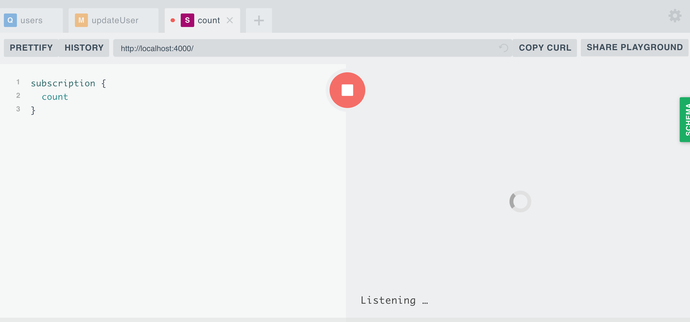

# #3. Mutation - Subscription

|   STT   | Nội Dung                                                                                                                            |
| :-----: | ----------------------------------------------------------------------------------------------------------------------------------- |
|  **I**  | [Mutation](#mutation)<br> &emsp; [1. Khái niệm](#def_mutate)<br>&emsp; [2. Thực hành](#use_mutate)<br>&emsp; [3. Bài tập](#btM)     |
| **II**  | [Subscription](#subscription)<br> &emsp; [1. Khái niệm](#def_subs)<br>&emsp; [2. Thực hành](#use_subs)<br>&emsp; [3. Bài tập](#btS) |
| **III** | [Mục tiêu cần đạt được](#summary)                                                                                                   |

<br>

## I. Mutation - GraphQL <a id="mutation"></a>

### 1. Khái niệm: <a id="def_mutate"></a>

- **Mutation type** là nơi phục vụ cho việc thay đổi database, tương tự method `POST`, `PUT` và `DELETE` của REST API. Giống như `Query`, `Mutation` cũng là một loại đối tượng đặt biệt trong GraphQL.
- **Lưu ý**: với REST API có 3 method hỗ trợ thay đổi database là CREATE, UPDATE và DELETE, nhưng với GraphQL chỉ dùng duy nhất khái niệm Mutation - đại diện cho 3 method trên.

### 2. Thực hành: <a id="use_mutate"></a>

#### A. Chuẩn bị:

Trước khi bắt đầu thực hành **Mutation**, xin nhắc lại là ở [bài 2 Query](https://github.com/vitalifyjp/vfa-workshop-graphql-apollo/tree/lession2#query) lần trước chúng ta đã dùng dữ liệu giả cố định để trả về.

Lần này thực hành với **Mutation** chúng ta sẽ sử dụng 1 mảng các `User` để thay thế cho 1 database thực tế và để có thể dễ dàng thấy sự thay đổi của data.

Vì vậy chúng ta sẽ update lại 1 chút phần **query** ở bài trước. Vào thư mục bai-tap/server tiến hành theo các bước sau:

- Step 1: **src/schema.js** update lại `tên`, `tham số` và `kiểu dữ liệu trả về` của query user

| Cũ                                                  | Mới                                                          |
| --------------------------------------------------- | ------------------------------------------------------------ |
| type Query { <br> &emsp; user(id: ID!): User! <br>} | type Query { <br> &emsp; user**s**: **[** User **]** ! <br>} |

- Step 2: **src/resolver.js**

Thêm mảng users vào đầu file:

```javascript
let users = [
  {
    id: 1,
    name: "Jone",
    age: 20
  },
  {
    id: 2,
    name: "Aily",
    age: 25
  },
  {
    id: 3,
    name: "Mina",
    age: 30
  }
];
```

Update function resolver để trả về mảng user thay vì data giả cố định.

Cũ:

```javascript
const resolvers = {
  Query: {
    user: (root, args, context, info) => ({
      id: args.id,
      name: `TrungTT-${args.id}`,
      age: 25
    })
  }
```

Mới:

```javascript
const resolvers = {
  Query: {
    user: (root, args, context, info) => users
  }
```

#### B. Thực hành thôi.

Giả định bài toán của chúng ta như sau: Có 1 mảng các user với id, name và age. Yêu cầu có 1 API tìm ra và update object tương ứng với id truyền vào, sau đó trả ra user đã được update. Các bước làm như sau:

- Step 1: Thêm type Mutation trong file **src/schema.js**

```javascript
    type Mutation {
        updateUser(id: ID!, name: String!, age: Int!): User!
    }
```

- Step 2: Implement resolver function trong file **src/resolver**

```javascript
const resolvers = {
  Mutation: {
    updateUser: (root, args, context, info) => {
      // Kiểm tra sự tồn tại của user trong mảng.
      const userIndex = users.findIndex(user => user.id == args.id);

      // Trả về lỗi nếu không tồn tại
      if (userIndex === -1) {
        throw new Error("User not found!");
      }

      // Tiến hành update user trong mảng.
      users[userIndex].age = args.age;
      users[userIndex].name = args.name;

      // Trả user đã update về lại cho client
      return users[userIndex];
    }
  }
};
```

- Run lại server và test:

```
npm start
```

- Mở http://localhost:4000/ và viết câu mutation của bạn vào để kiểm tra:

```graphql
mutation {
  updateUser(id: 1, name: "Scofield", age: 20) {
    id
    name
    age
  }
}
```

- Kiểm tra mảng có được update bằng câu query **users**.

```graphql
query {
  users {
    id
    name
    age
  }
}
```

- Test với id khác và với id không tồn tại trong mảng.

### 3. Bài tập thực hành <a id="btM"></a>

- Viết câu mutation cho tính năng thêm mới user. (Thêm vào mảng users)
- Viết câu mutation cho tính năng xoá user. (Xóa khỏi mảng users)

<hr>

## II. Subscription: <a id="subscription"></a>

### 1. Khái niệm: <a id="def_subs"></a>

- Subscription là một tính năng của GraphQL, thường được implement bằng [WebSocket](https://viblo.asia/p/websocket-la-gi-Ljy5VxkbZra) để giữ sự kết nối giữa realtime server và client qua đó cho phép Server có thể gửi data cho client.

- Subscription cho phép chúng ta theo dõi (subscribe) sự thay đổi của data và gửi trả data mới cho client.

> Ví dụ: Bạn viết comment trên 1 bài post của Facebook, nghĩa là bạn đã subscribe comment của chính mình. Khi có bất cứ ai reply lại comment của bạn, server sẽ gửi thông báo và dữ liệu về reply đó cho phía client.

### 2. Thực hành: <a id="use_subs"></a>

#### A. Basic

Chúng ta sẽ viết 1 Subscription đơn giản trước. Subscription này sẽ đếm số giây từ khi client liên kết với Server.

- Step 1: Thêm type Subcription vào Schema trong file **src/schema.js**

```graphql
type Subscription {
  count: Int!
}
```

- Step 2: Implement function resolver trong file **scr/resovler.js**

```javascript
// Import module PubSub (Public Subcribe) để hỗ trợ cho subcription.
import { PubSub } from "apollo-server";
// Khởi tạo pubsub
const pubsub = new PubSub();

const resolvers = {
  Query: {
    users: (root, args, context, info) => users
  },
  Mutation: {
    ...
  },
  Subscription: {
    // Map với tên Subscription ở schema
    count: {
      subscribe: (root, args, context, info) => {
        let countData = 0;

        // asyncIterator là function dùng để listen event async.
        // Tham số "Count-LabelEvent" là label của event mình muốn listen.
        return pubsub.asyncIterator('Count-LabelEvent');
      }
    }
  }
};
```

- Step 3: Check thử với playground: http://localhost:4000/
  
  Bạn sẽ thấy kết nối giữa client và server đã được thành lập. Và xuất hiện dòng chữ `listening...`

<br>

- Step 4: Send notice tới event. Update resolver trong file src/resolver.js như sau:

```javascript
count: {
  subscribe: (root, args, context, info) => {
    let count = 0;
    // Dùng interval để mỗi giây chúng ta notice 1 lần.
    setInterval(() => {
      countData++;
      // publish là function dùng để send notice tới event mà hàm asyncIterator đang lắng nghe. Ở đây là event "Count-LabelEvent".
      // Ở đây cứ mỗi giây chúng ta send notice 1 lần với data là biến count
      pubsub.publish("Count-LabelEvent", {
        count: countData
      });
    }, 1000);
    // asyncIterator là function dùng để lắng nghe event async.
    // Tham số "count" là label của event mình muốn listen. (tự mình đặt: abc, xyz gì cũng OK)
    return pubsub.asyncIterator("Count-LabelEvent");
  };
}
```

- Step final: Check lại với playground.
  Expected: cứ mỗi 1 giây, dữ liệu sẽ được trả về.

#### B. Subcription event updateUser:

- Step 1: Thêm schema:

```graphql
type Subscription {
  count: Int!
  updateUser(userId: ID!): User!
}
```

- Step 2: Implement function resolver cho subcription:

```javascript
count: {...
},
updateUser: {
    subscribe: (root, args, context, info) => {
        // Kiểm tra sự tồn tại của user
        const userIndex = users.findIndex(user => user.id == args.userId);

        // Trả về lỗi nếu không tồn tại
        if (userIndex === -1) {
            throw new Error("User not found!");
        }
        // Chúng ta sẽ lắng nghe event update tới userId nhất định.
        // Bằng cách đặt tên event theo userId như sau.
        return pubsub.asyncIterator(`UPDATE_USER_${args.userId}`);
    }
}
```

- Step 3: Send notice tới event mỗi khi thực hiện mutation updateUser. Update mutation updateUser trong file src/resolver.js

```javascript
updateUser: (root, args, context, info) => {
    // Kiểm tra sự tồn tại của user
    const userIndex = users.findIndex(user => user.id == args.id);

    // Trả về lỗi nếu không tồn tại
    if (userIndex === -1) {
    throw new Error("User not found!");
    }

    // Tiến hành update user trong mảng.
    users[userIndex].age = args.age;
    users[userIndex].name = args.name;
    // Send notice tới event đang được subscription theo id
    pubsub.publish(`UPDATE_USER_${args.id}`, { updateUser: users[userIndex] });
    // Trả user đã update về lại cho client
    return users[userIndex];
};
```

- Step final: Check lại với playground.
  - run Subscription **updateUser** để thành lập kết nối.
  - run Mutation **updateUser** ở tab mới
  - check lại tab  Subscription. Expected: là dữ liệu update mới được trả về cho subscription.


### 3. Bài Tập: <a id="btS"></a>
- Viết subscription cho Mutation CreateUser và DeleteUser.


## III. Mục tiêu cần đạt: <a id="summary"></a>
 - Hiểu và làm được mutation + subscription.
 - Làm được bài tập.
