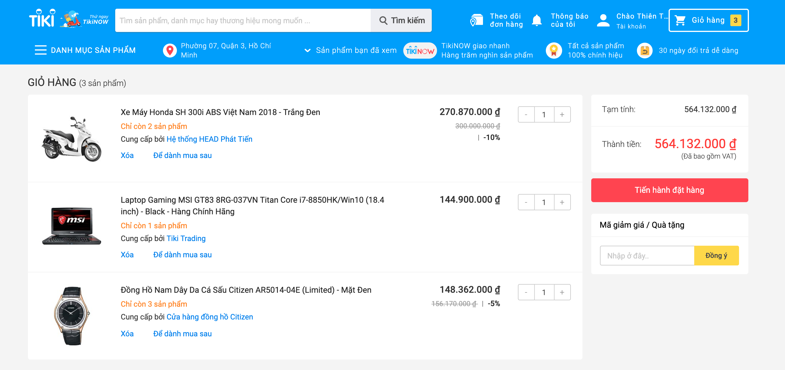
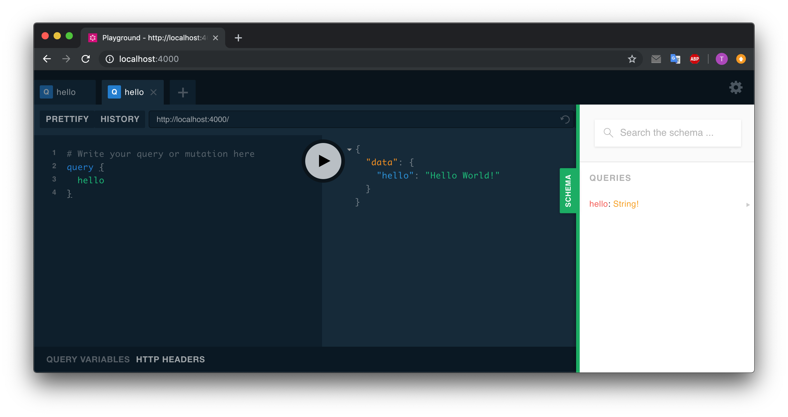

# Introduction + Setup + Hello World

STT|Nội Dung|
:---:|---|
**I**|[GraphQL là gì? & Tại sao cần đến GraphQL?](#why)<br><br>[1. GraphQL là gì?](#what)<br> [ 2. So sánh giữa RESTful và GraphQL](#sosanh)<br>[3. Ưu và khuyết của GraphQL](#uukhuyet)
**II**|[Cài đặt môi trường](#setup)
**III**|[Hello world](#hello)
**IV**|[Kết quả cần đạt được](#summary)

<br>

## I. What and Why <a id="why"></a>:
### 1. GraphQL là gì.<a id="what"></a>
&emsp; ❌ GraphQL **không** phải là một ngôn ngữ lập trình cụ thể nào.<br>
&emsp; ❌ GraphQL **không** phải là một thư viện.<br>
&emsp; ✅ GraphQL là 1 [query language](# "Là tên gọi chung để chỉ các ngôn ngữ máy tính được dùng để tạo các truy vấn trong các cơ sở dữ liệu và các hệ thống thông tin.") dành cho API. Vận hành dựa trên [giao thức HTTP](https://www.digistar.vn/http-la-gi-tim-hieu-ve-giao-thuc-http-va-https/ "Http (HyperText Transfer Protocol) là giao thức truyền tải siêu văn bản được sử dụng trong www dùng để truyền tải dữ liệu giữa Web server đến các trình duyệt Web và ngược lại.") (Request/Response)
> Hãy hiểu đơn giản nó là 1 chuẩn API tương tự như RESTful.

### <a id="sosanh"></a>2. So sánh giữa RESTful và GraphQL.
Giả sử ta có với trang giỏ hàng như hình sau:



##### a. Bạn phải request tới những API endpoint sau:
RESTful|GraphQL|
---|---|
`localhost/carts/1` => *Lấy thông tin của giỏ hàng*<br>`localhost/products/1`=> *Lấy thông tin của sản phẩm #1*<br>`localhost/products/2`=> *Lấy thông tin của sản phẩm #2*<br>`localhost/products/3`=> *Lấy thông tin của sản phẩm #3*|`localhost/graphql`=> *Lấy tất cả thông tin cần thiết*
<span style="color:red">RESTful phải request nhiều lần đến nhiều endpoint để lấy dữ liệu</span>|<span style="color:blue">GraphQL chỉ cần request đến 1 endpoint duy nhất</span>
<br>

##### b. Request & Response của API:
.|RESTful|GraphQL|
:---:|---|---|
**Request**|`localhost/products/1`|`localhost/grapgql`
**Request Payload**|| query: {<br>&emsp;product(id: "1") {<br>&emsp;&emsp;id<br>&emsp;&emsp;name<br>&emsp;&emsp;prize<br>&emsp;&emsp;provider<br>&emsp;&emsp;quantity<br>&emsp;&emsp;discount<br>&emsp;}<br>}
**Response**|{<br>&emsp;`"id": "1"`,<br>&emsp;`"name": "Xem Máy Honda SH 300i ABS Việt Nam 2018 - Trắng đen"`,<br>&emsp;`"prize": "270870000"`,<br>&emsp;`"provider": "Hệ thống HEAD Phát Tiến"`,<br>&emsp;`"quantity": "2"`,<br>&emsp;`"discount": "10%"`,<br>&emsp;<br>&emsp;<span style="color:red; background:#E6D8D8"> "region": "TPHCM"</span>,<br>&emsp;<span style="color:red; background:#E6D8D8"> "country": "Japan"</span>,<br>&emsp;<span style="color:red; background:#E6D8D8"> "weight": "169kg"</span>,<br>&emsp;<span style="color:red; background:#E6D8D8"> "brand": "Honda"</span>,<br>&emsp;<span style="color:red; background:#E6D8D8"> "detail": "Có ABS"</span><br>}|{<br>&emsp;`"id": "1"`,<br>&emsp;`"name": "Xem Máy Honda SH 300i ABS Việt Nam 2018 - Trắng đen"`,<br>&emsp;`"prize": "270870000"`,<br>&emsp;`"provider": "Hệ thống HEAD Phát Tiến"`,<br>&emsp;`"quantity": "2"`,<br>&emsp;`"discount": "10%"`<br><br><br><br><br><br><br>}
**=>**|<span style="color:red">Response của RESTful có rất nhiều dữ liệu thừa. <br>**(Server trả về thế nào, Client phải nhận thế ấy, không được ý kiến)**</span>|<span style="color:blue">GraphQL cho phép Client khai báo cần dữ liệu gì ở request payload, Server sẽ trả về chính xác những gì client cần <br>**(Nothing more, nothing less)**</span>
<br>

### 3. Ưu và khuyết của GraphQL<a id="uukhuyet"></a>

* ***Ưu điểm:***

Ưu điểm|GraphQL
:---|---
**Fast**| Chỉ request đến 1 endpoint duy nhất, nên tốc độ sẽ nhanh hơn. Không cần phải request nhiều lần.
**Flexible**| Cùng 1 API có thể customize data cần thiết cho từng client. (Desktop cần nhiều fields, mobile cần ít fields ...) => Performance cao.
**Easy to use & maintain**| - Khi có thay đổi của model từ phía client. Client chỉ cần update câu query là đủ. Server API không cần làm gì cả. <br> - Trường hợp khi API từ phía server có sự thay đổi cần thêm 1 số dữ liệu mới. Sự ảnh hưởng đến các client là không có. API vẫn tương thích ngược được với các Client cũ.
**Hỗ trợ Subcription**|Một yêu cầu quan trọng khác đối với nhiều ứng dụng đó chính là realtime, để có thể kết nối đến máy chủ để có được thông tin về các event ngay lập tức. Trong trường hợp này, GraphQL cung cấp các khái niệm gọi là subscriptions. Khi 1 client subscriptions một event, nó cũng bắt đầu và giữ các kết nối đến server. Bất cứ khi nào sự kiện đó xảy ra, server sẽ đẩy dữ liệu tương ứng đến client.


<br>

* ***Khuyết điểm:***
So với với RESTful, GraphQL có nhiều ưu điểm hơn để giải quyết các về, tuy nhiên GrapghQL không phải là toàn diện nó vẫn còn những mặc hạn chế sau:

Khuyết điểm|GraphQL
:---|---
Everything is POST|- Tất cả các request đều sử dụng phương thức POST => Việc implement [HTTP caching](https://viblo.asia/p/http-caching-6BAMYknzvnjz "Kỹ thuật HTTP Caching chính là việc bạn chuyển một bản copy các tài nguyên tĩnh phía Server xuống lưu ở dưới Client. Về cơ bản, người dùng sẽ cảm nhận thấy một độ trễ rất thấp khi yêu cầu các tài nguyên tĩnh này từ phía Server, lưu lượng truyền đi ít hơn, số request đến Server ít hơn, do vậy Server sẽ nhàn hơn để dùng sức của mình vào những việc khác.") rất phức tạp.
JSON|- Chỉ hỗ trợ định dạng JSON
Performance|- Bởi vì cho phép client tùy ý lấy các field mong muốn, nên sẽ có những vấn đề liên quan đến performance khi client yêu cầu quá nhiều field lồng nhau.

----


## II. Setup <a id="setup"></a>:
 **1. Environemt:**
 - [Nodejs and npm](https://nodejs.org/en/)
 - [git](https://git-scm.com/)

 **2. Clone this repository into local**
 ```shell
git clone git@github.com:thientrung/graphql-tutorial.git
 ```

 **3. Install package**
 - Truy cập vào folder server:
```shell
cd graphql-apollo-tutorial/bai-tap/server
```
 - Install package
```shell
npm install
```

 **4. Try to start**
```shell
npm start
```

 output should be: ***Hello World***

----
## III. Hello World<a id="hello"></a>:
#### **Step 1: Khởi tạo server**
 - **Edit file: `src/index.js`**
```javascript
// Sử dụng syntax của ES6 để import thư viện
import { ApolloServer } from "apollo-server";

const server = new ApolloServer({});

server.listen().then(({ url }) => {
  console.log(`🚀  Server ready at ${url}`);
});
```
 - **Chúng ta đã sử dụng nodemon để restart lại khi có sự thay đổi nên không cần phải chạy lại lệnh `npm start`. chỉ cần quan sát màn hình console**

 > Expected: Lỗi thông báo thiếu `schema` khi khởi tạo GraphQLServer.**

```shell
    throw Error('Apollo Server requires either an existing schema or typeDefs');
                ^

Error: Apollo Server requires either an existing schema or typeDefs
    at new ApolloServerBase (/Users/trungtran/Projects/Workshop/graphql-apollo/graphql-apollo-tutorial/start/server/node_modules/apollo-server-core/src/ApolloServer.ts:220:15)
```

<br>
<br>

#### **Step 2: Thêm Schema cho GraphQLServer**
 - **Khai báo schema trong file `src/schema.js`:**
```javascript
import {gql} from 'apollo-server';

const typeDefs = gql`
  type Query {
    hello: String!
  }
`;

export default typeDefs;
````
<br>

 - **Khai báo resolvers trong file `src/resolvers.js`:**
```javascript
const resolvers = {
    Query: {
        hello: () => {
            return 'Hello World!'
        }
    }
};

export default resolvers;
```

 - **Import schema và resolvers và `src/index.js`:**
```javascript
import { ApolloServer } from "apollo-server";
import typeDefs from "./schema";
import resolvers from "./resolvers";

const server = new ApolloServer({typeDefs, resolvers});

server.listen().then(({ url }) => {
  console.log(`🚀 Server ready at ${url}`);
});

```

 - **Expected: Log message**
```shell
🚀 Server ready at http://localhost:4000/
```
 - Truy cập URL: `localhost:4000` (4000 is default port) và thử query **hello**


----
## IV. Kết quả cần đạt được sau buổi học đầu tiên này" <a id="summary"></a>:

#### 1. Nắm được GraphQL là gì
#### 2. Điểm mạnh yếu giữa GraphQL và RESTful
#### 3. Thực hành được `Hello World`

 - Cấu trúc source code được chia ra làm 2 thư mục:
   - **bai-tap**: trống => dùng để thực hành.
   - **tham-khao**: kết quả có sẳn => tham khảo khi gặp vấn đề.
