Table of contents
=================

* [Authenticate](#Authenticate)
    * [1. Bối cảnh](#bc)
    * [2. Đóng cửa Prisma với thế giới](#close)
    * [3. Update lại mutation createUser với email và password](#update_email_pass)
    * [4. Tạo mutation Login](#login)
    * [5. Authentication Token](#auth_token)
* [Kết quả cần đạt được](#sum)

----

## I. Authenticate <a id="Authenticate"></a>

### 1. Bối cảnh: <a id="bc"></a>
- Ở bài trước [(Xem lại tại đây)](https://github.com/thientrung/graphql-tutorial/tree/lesson4) chúng ta đã setup Prisma để có thể lưu trữ database.

- Bạn có thể thấy chúng ta có 2 điểm có thể truy cập để query và update database:
  - URL của GraphQL server: http://localhost:4000/
  - Endpoint của Prisma: https://us1.prisma.sh/vfatrungtt3-0df8f7/prisma-db/dev

<br/>

> Bạn có thể truy cập đến  thông qua GraphQL server như sau: (Cách Official)
<a id="1"></a>

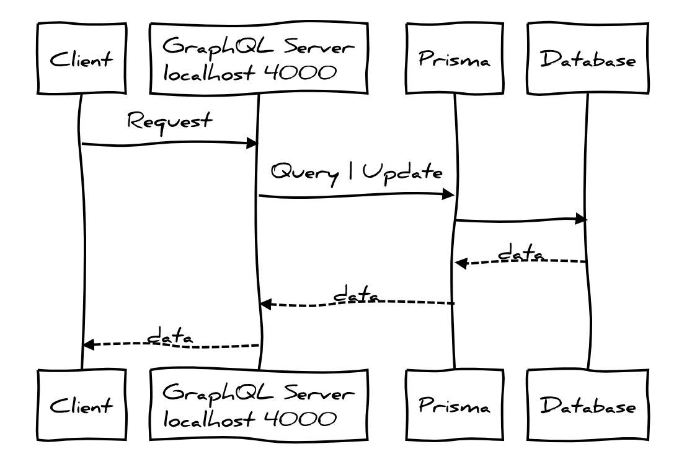
<br/>

> Bạn cũng có thể truy cập trực tiếp đến Endpoint của Prisma mà không cần thông qua GraphQL server.

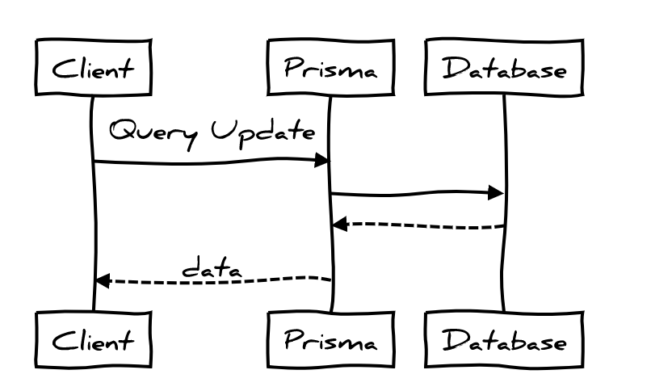

> Hãy thử truy cập đến Endpoint Prisma của bạn, chọn tab Schema trên playground. Bạn sẽ thấy đầy đủ các query, mutation, subscription.
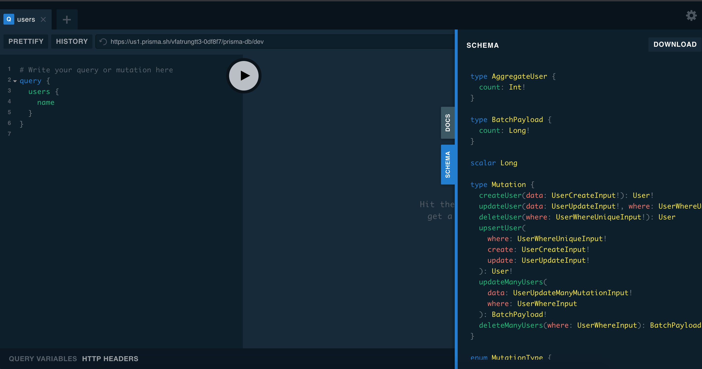


⚠️ ***Có thể thấy rằng với config hiện tại thì với bất cứ ai có được Endpoint của Prisma đều có thể truy cập và thay đổi DB. Điều này hết sức nguy hiểm.***

✅ ***Chúng ta cần thay đổi để cho phép chạm tới DB khi và chỉ khi thông qua GraphQL server. Bằng cách khóa Prisma lại.***

----

### 2. Đóng cửa Prisma với thế giới 🔐  <a id="close"></a>
<a id="closeprisma"></a>
- Chúng ta sẽ cài đặt Prisma với một ổ khóa để khi nào có đúng chìa khóa thì mới cho phép truy cập.

> Không có key

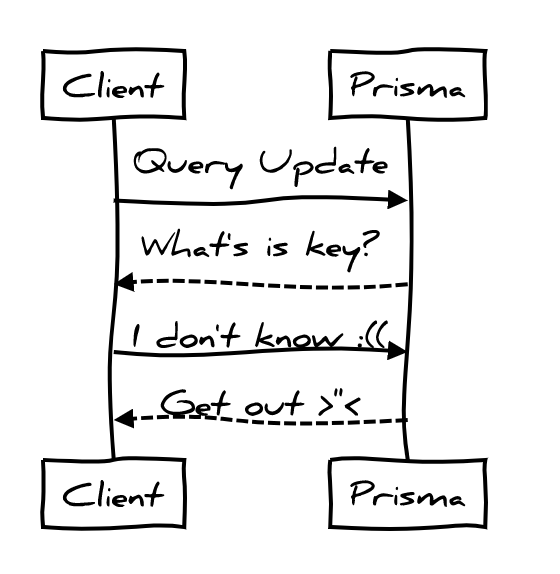
<br/>

>Chúng ta septup cho GraphQLServer chứa key

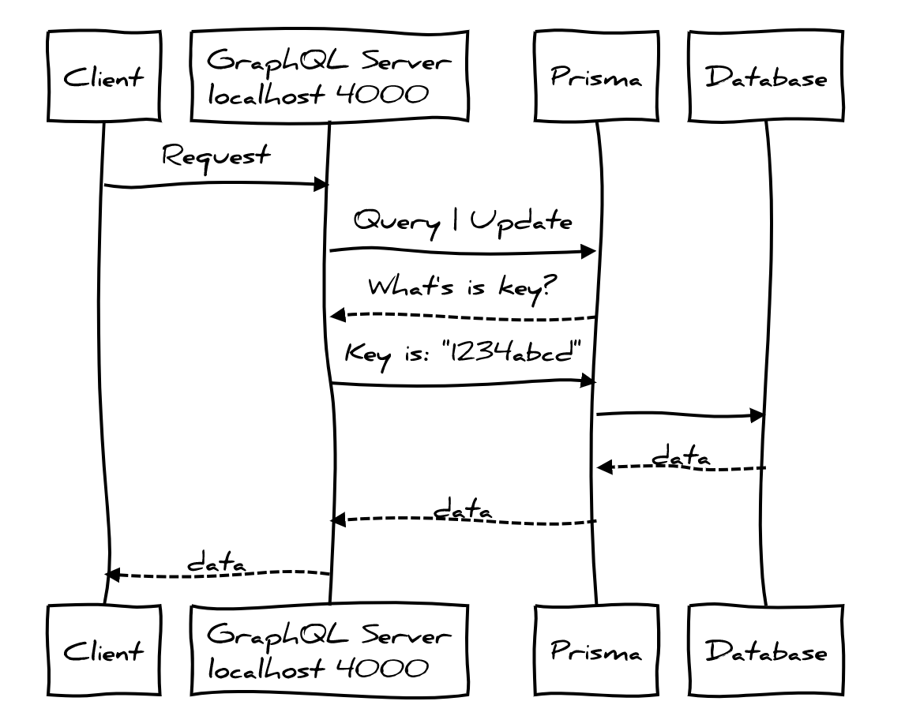
<br/>

- **Step 1**: Update file `bai-tap/server/prisma-db/prisma.yml` thêm property `secret` *(là key ở ví dụ trên)* với string bất kỳ. Bạn có thể dùng các công cụ để auto generate để tăng tính bảo mật. Ở đây ta dùng string: **thisismysupersecrettext**

```diff
endpoint: https://us1.prisma.sh/vfatrungtt3-0df8f7/prisma-db/dev
datamodel: datamodel.prisma
+ secret: thisismysupersecrettext

generate:
  - generator: javascript-client
    output: ./generated/prisma-client/

hooks:
  post-deploy:
    - prisma generate
```

- **Step 2**: Deploy lại Prisma. Đứng tại folder `prisma-db` Run command:

```shell
prisma deploy
```

 - **Testing**: Truy cập lại Endpoint của Prisma để test.

 > Thử query và mở Schema trên Playground bạn sẽ không thể lấy kết quả được như trước nữa. Và Schema thì quay đều...
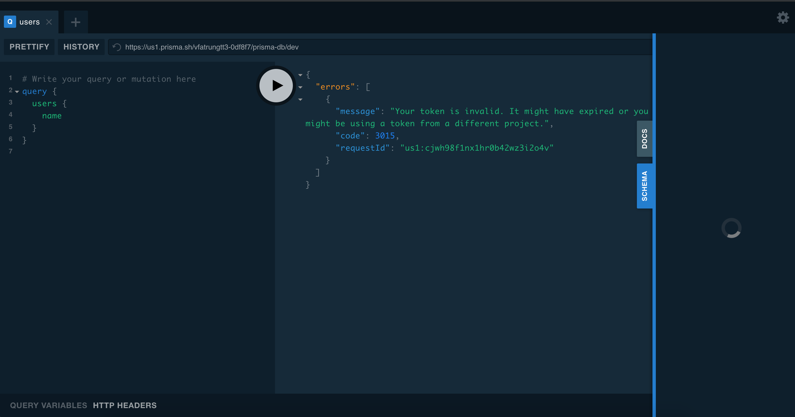

<br/>

🌟 ***Chúng ta đã khóa Prisma với thế giới***

- Hãy thử test lại với GraphQL Server.
> Vẫn query dữ liệu được bình thường
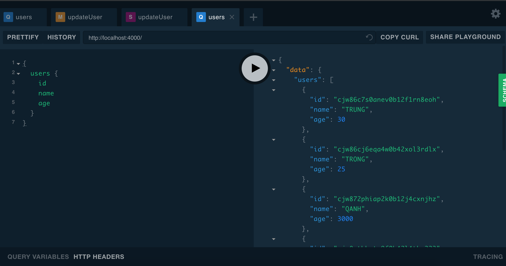

🤔 **Tại sao vậy?**
- Mở file `prisma-db/prisma-client/index.js` bạn sẽ thấy `secret` đã được tự động thêm vào.

```diff
exports.Prisma = prisma_lib_1.makePrismaClientClass({
  typeDefs,
  models,
  endpoint: `https://us1.prisma.sh/vfatrungtt3-0df8f7/prisma-db/dev`,
+ secret: `thisismysupersecrettext`
});
```

- Sau khi chúng ta update prisma.yml và deploy thì cần generate lại client. Nhưng chúng ta đã setup auto generate khi prisma deploy ở bài trước [(tại đây)](https://github.com/thientrung/graphql-tutorial/tree/lesson4#datamodel) nên field `secret` đã được tự động thêm vào.

- GraphQL Server sử dụng prisma-client nên sẽ có được key secret để tương tác với Prisma.

----

### 3. Update lại mutation createUser với email và password  <a id="update_email_pass"></a>

🍎 Chúng ta sẽ update lại API **createUser** để thêm `email` và `password` phục vụ cho việc **login** chúng ta sẽ làm ở phần tiếp theo.

<br/>

#### a. Step 1 - Update schema

Thêm 2 field `email` và `password`vào datamodel của Prisma và schema của GraphQL server

> bai-tap/server/prisma-db/***datamodel.prisma***

```diff
type User {
  id: ID! @id
  name: String!
  age: Int
  friends: [User]
+ email: String! @unique
+ password: String!
}

+type Post {
+  id: ID! @id
+  title: String!
+  body: String!
+  author: ID!
+}
```

> bai-tap/server/src/***schema.js***
```diff
type User {
    id: ID
    name: String
    age: Int
    friends: [User]
+   email: String!
+   password: String!
}

+type Post {
+  id: ID!
+  title: String!
+  body: String!
+  author: ID!
+}
```

Type Post chúng ta thêm vô ở đây sẽ dùng để viết API áp dụng authentication ở phần sau. Tạm thời chưa bàn về type này.
<br/>

#### b. Step 2 - Xóa service Prisma cũ và deploy lại service với datamodel mới.

- Chạy lệnh sau để xóa Prisma service

    ```shell
    prisma delete
    ```
    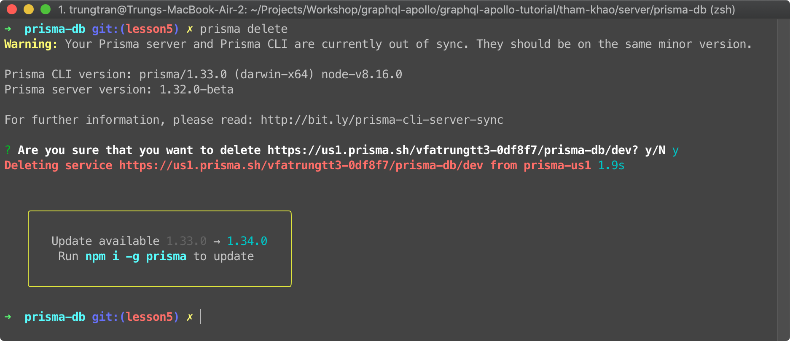

<br/>

- Chạy lệnh sau để deploy lại Prisma service

    ```shell
    prisma deploy
    ```
    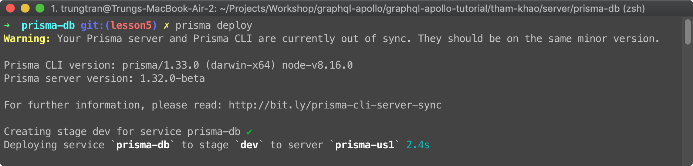


<br/>

#### c. Step 3 - Update lại schema mutation createUser.

- Update schema input và response của mutation createUser:
    File: bai-tap/server/src/schema.js
    ```diff
        type Mutation {
            createUser(input: UserInput): User!
            updateUser(id: ID!, name: String!, age: Int!): User!
            deleteUser(id: ID!): Boolean!
        }

        input UserInput {
            name: String!
            age: Int!
    +       email: String!
    +       password: String!
        }

        type User {
            id: ID
            name: String
            age: Int
            friends: [User]
    +       email: String!
    +       password: String!
        }
    ```

#### d. Step 4 - Update lại resolver method của mutation createUser.

- Chúng ta sẽ sử dụng thêm thư viện: **bcryptjs** để hash password, chạy lệnh sau ở thư mục bai-tap/server để cài đặt
  ```shell
  npm install bcryptjs --save
  ```
<br/>

- Update method resolver của mutation createUser:
```diff
+ import bcrypt from "bcryptjs";

...

Mutation: {
-   createUser: (root, args, context, info) => {
-     return context.prisma.createUser({
-         ...args.input
-     });
+   createUser: async (root, args, context, info) => {
+     // Check length password
+     if (args.input.password.length < 8) {
+       throw new Error("Password must be 8 characters or longer");
+     }

+     // Hash password để lưu trong database
+     const password = await bcrypt.hash(args.input.password, 10);

+     // Tạo user mới với thông tin từ input
+     // và override password string thường bằng password đã được hash
+     return context.prisma.createUser({
+       ...args.input,
+       password
+     });
+   },
```

#### e. Step 5 - Testing

-  Test với playground http://localhost:4000/.

Access playground và thử chạy mutation create user.
Kết quả trả về thông tin user với password đã được hash là 🎉 OK
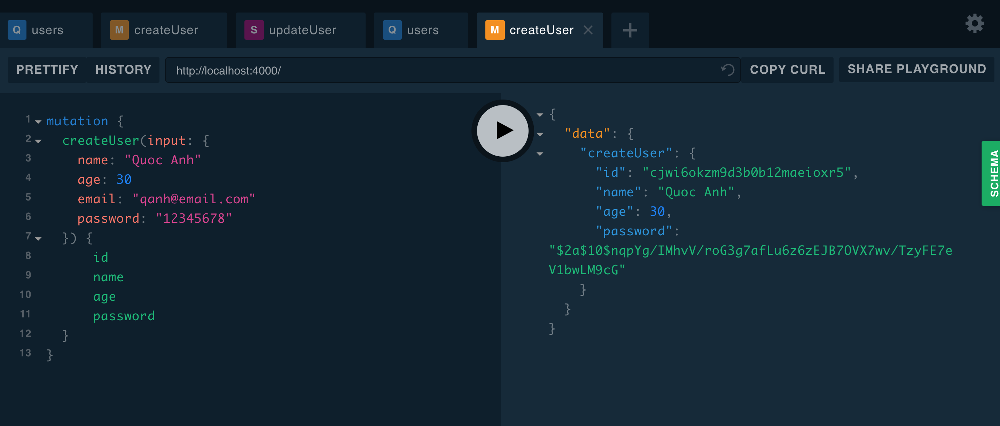

- Check trên trang Prisma Admin để xem thử User mới đã được lưu chưa?

Truy cập đến trang admin của Prisma, nếu quên URL bạn có thể mở lại file: `prisma-db/prisma.yml` thêm vào đuôi của endpoint **/_admin**
Bạn thấy lỗi như bên dưới đúng không? :D
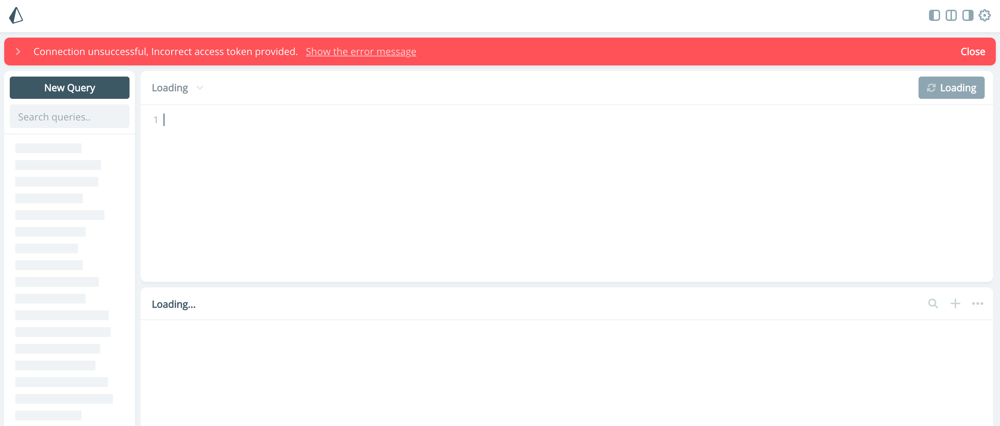

Đừng lo, bạn còn nhớ field `secret`  chúng ta đã thêm vô file prisma.yml ở phần [(2. Đóng cửa Prisma với thế giới)](#closeprisma) chứ.
Chúng ta đã khóa cửa Prisma với thế giới rồi nên là trang admin cũng khóa theo luôn. Để truy cập trang admin như cũ chúng ta làm như sau:
- generate token của prisma, bằng việc chạy lệnh sau ở thư mục **prisma-db**
```
prisma token
```
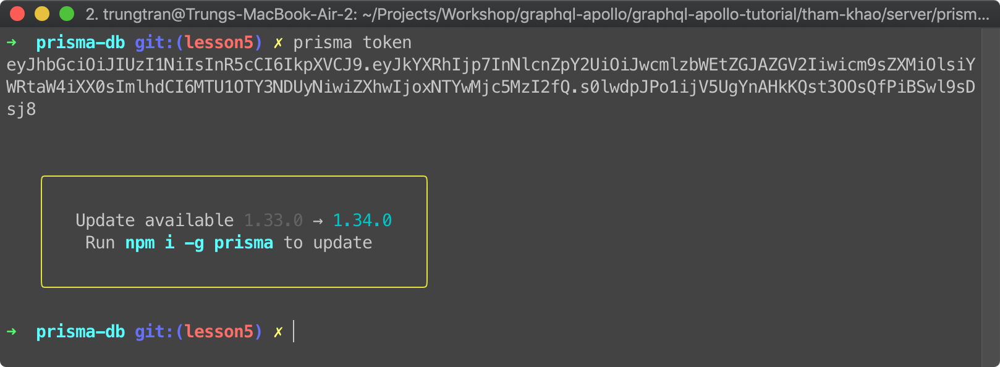
Copy token vừa tạo vào trang admin.
Click vào hình bánh răng để vào setting như hình bên dưới.
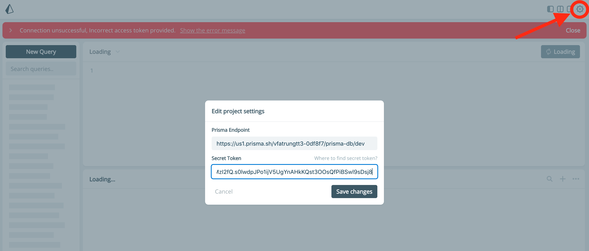

Nhấn **Save changes** và refresh lại trang chúng ta đã có thể query db như cũ. Và kiểm tra User vừa mới tạo ở trên.
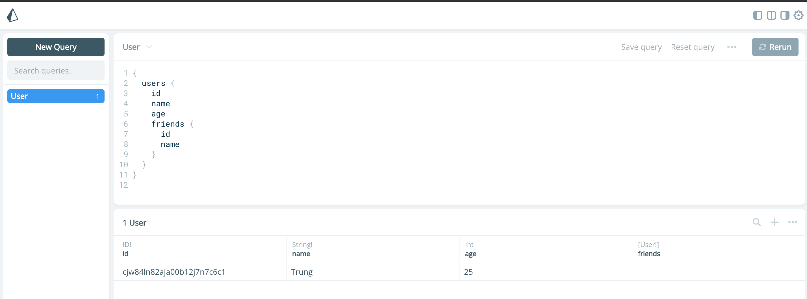
User mới đã được lưu với password đã được hash.

#### f. Homework:
- Viết thêm 1 mutation để updatePassword. Gồm 3 tham số:
  - email
  - password (hiện tại)
  - newPassword
- Kết quả trả về là thông tin user với password mới đã được hash.
- Phải có bước check xem email và password cũ có đúng hay không.

----

### 4. Tạo mutation Login <a id="login"></a>

- Chúng ta sẽ sử dụng [JSON web token](https://techmaster.vn/posts/33959/khai-niem-ve-json-web-token) để xác thực.
- Khi client login thành công server sẽ generate 1 chuỗi mã gọi là token và trả về cho client.
- Từ đó, khi request đến các API cần xác thực, client sẽ gửi kèm token trong header của request qua đó server sẽ xác thực được.

#### a. Step1: Định nghĩa Schema:

- Định nghĩa mutation và các type cần thiết trong file `bai-tap/server/src/schema.js`

```diff
  type Mutation {
    createUser(input: UserInput): User!
    updateUser(id: ID!, name: String!, age: Int!): User!
    deleteUser(id: ID!): Boolean!
+   login(input: LoginInput!): AuthPayload!
  }

+ input LoginInput {
+   email: String!
+   password: String!
+ }

+ type AuthPayload {
+   token: String!
+   user: User
+ }
```

#### b. Step2: Định nghĩa method resolver cho mutation login

Cài đặt thư viện **jsonwebtoken** để generate ra token, chạy lệnh sau ở thư mục bai-tap/server để cài đặt ```npm install jsonwebtoken --save```

```diff
+ import jwt from "jsonwebtoken";

...
Mutation: {
+ login: async (root, args, context, info) => {
+     // Tìm kiếm user bằng email
+     const user = await context.prisma.user({
+       email: args.input.email
+     });

+     if (!user) {
+       throw new Error("Unable to login");
+     }

+     // Dùng method compare của thư viện bcrypt để verify password
+     const isMatch = await bcrypt.compare(args.input.password, user.password);

+     if (!isMatch) {
+       throw new Error("Unable to login");
+     }

+     return {
+       user,
+       token: jwt.sign({ userId: user.id }, "thisismysecret", {
+         expiresIn: "5m"
+       })
+     };
+   },
  createUser: async (root, args, context, info) => {
```

⚠️ **CHÚ Ý RẰNG:** Chúng ta dùng hàm `sign` của thư viện jsonwebtoken để generate token. Hàm này cần ít nhất 2 parameters.
> param1: { userId: user.id }
param2: *"thisismysecret"*
param3: {expiresIn: "5m"}

> Cả 2 params 1 và 2 cùng dùng để generate token. Param thứ 2 còn gọi là secret key là rất quan trọng trong việc xác thực.

> Kẻ xấu có thể dễ dàng có được userId để tạo ra token giả và cố gắng vượt qua lớp xác thực của hệ thống, tuy nhiên nếu không có secret key mà chỉ có userId thì không đủ. Vì vậy secret key tuyệt đối không thể để lộ ra bên ngoài.

> Còn param thứ 3 là option của token. Như ví dụ trên là dùng để set thời gian hết hạn cho token.

#### c. Testing
Mở playground http://localhost:4000/ và test mutation login

- Thử nhập sai password
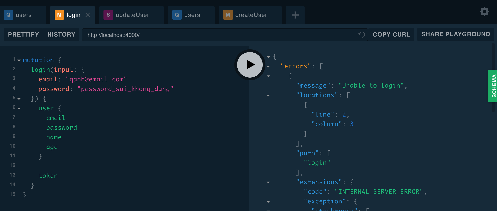

- Nhập đúng
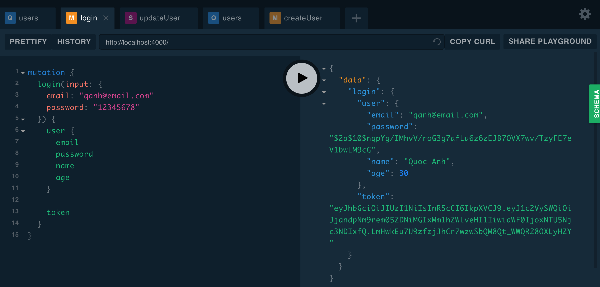
Kết quả trả về được thông tin user và token là OK 🎉

----

### 5. Authentication Token <a id="auth_token"></a>

Chúng ta sẽ viết 1 API mutation createPost, áp dụng authenticate token.
Nghĩa là client phải đăng nhập => có token => thì mới có thể tạo Post mới.
Chúng ta sẽ set token vào header: `Authorization` của request từ client.

#### a. Update Context của GraphQL Server

- Bới vì token được set trong header của request nên vì vậy, các mutation/query của chúng ta cần access được đến request để kiểm tra.
Update file `bai-tap/server/src/index.js` để truyền request vào context.

```diff
const server = new ApolloServer({
  typeDefs,
  resolvers,
  context: req => ({
    prisma,
+   req
  })
});
```

#### b. Update schema và resolver cho mutation creatPost

- bai-tap/server/src/schema.js

```diff
type Mutation {
    createUser(input: UserInput): User!
    updateUser(id: ID!, name: String!, age: Int!): User!
    deleteUser(id: ID!): Boolean!
    login(input: LoginInput!): AuthPayload!

+   createPost(input: PostInput): Post!
}

+ input PostInput {
+   title: String!
+   body: String!
+   author: ID!
+ }

```

- bai-tap/server/src/resolvers.js
thêm resolver method vào mutation

```javascript
createPost: async (root, args, context, info) => {
    return context.prisma.createPost({
        title: args.input.title,
        body: args.input.body,
        author: args.input.author
    });

    return post;
}
```

Hiện tại chỉ mới là 1 mutation thông thường.
Chúng ta cần thêm step authentication nữa.

#### c. Tạo folder utils và file getUserId.js để lấy userId từ request.

- Tạo folder src/utils
- Tạo file src/utils/getUserId.js

```javascript
import jwt from "jsonwebtoken";

const getUserId = req => {
  const header = req.req.header('authorization');

  if (!header) {
    throw new Error("Authentication required");
  }

  const token = header.replace("Bearer ", "");
  const decoded = jwt.verify(token, "thisismysecret");

  return decoded.userId;
};

export default getUserId;
```

#### d. Thêm step Authenticate cho createPost

- Update file src/resolvers.js

```diff
+ import getUserId from './utils/getUserId'
...

createPost: async (root, args, context, info) => {
+   const userId = getUserId(context.req)
    return context.prisma.createPost({
        title: args.input.title,
        body: args.input.body,
        author: userId
    });
}
```

#### e. Testing

- Testing bằng playground http://localhost:4000/

- Đầu tiên là login để lấy token
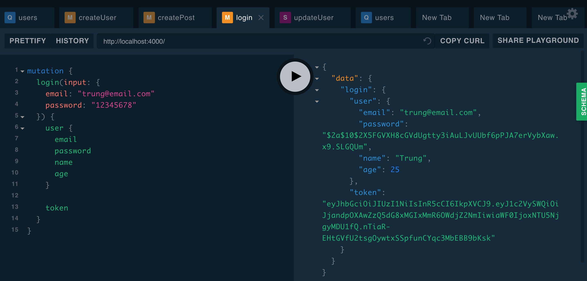

- Thử gọi mutation createPost mà không có token
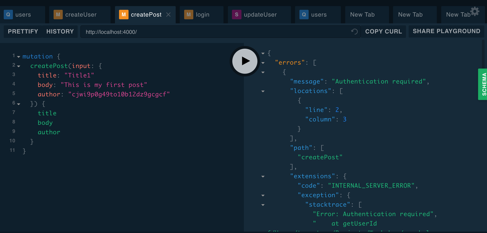

- Thêm token và header `Authorization` như sau: (nhớ thêm prefix `Bearer` vào phía trước token)
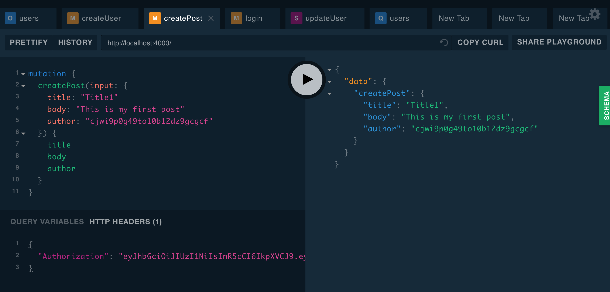

#### f. Homework

- Viết mới 2 mutation updatePost và deletePost với authentication.

----

## II. Kết quả đạt được sau buổi học: <a id="sum"></a>

- Hiểu được cơ chế Authenticate với Json Web Token

- Biết được cách implement.
