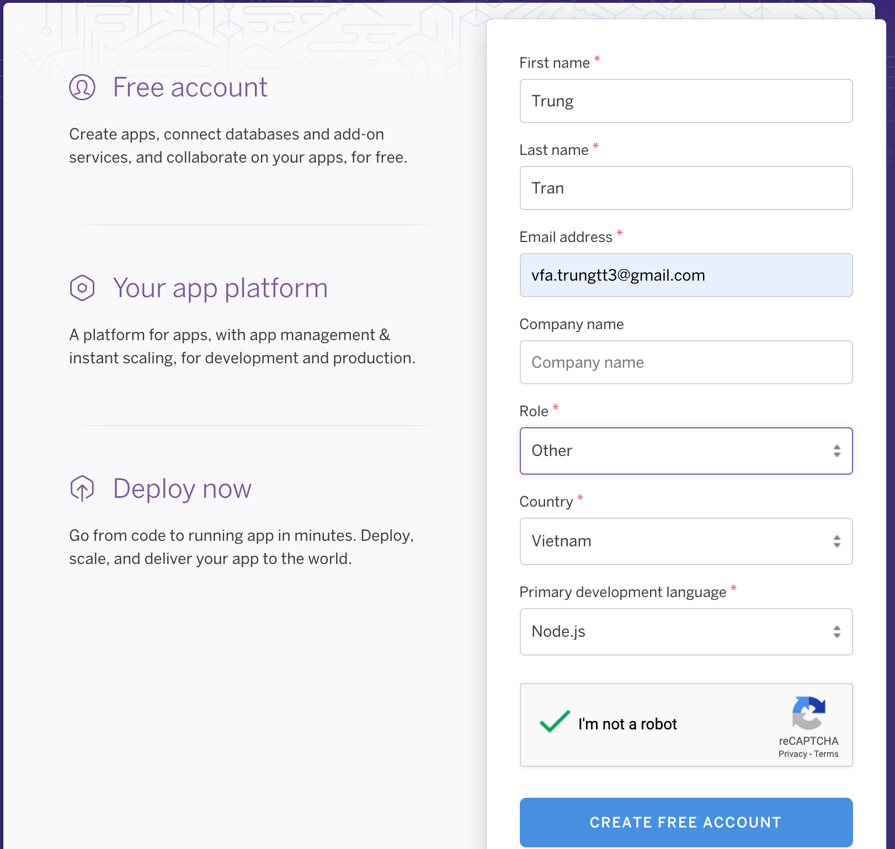
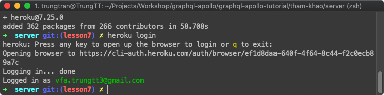
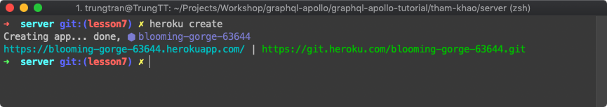
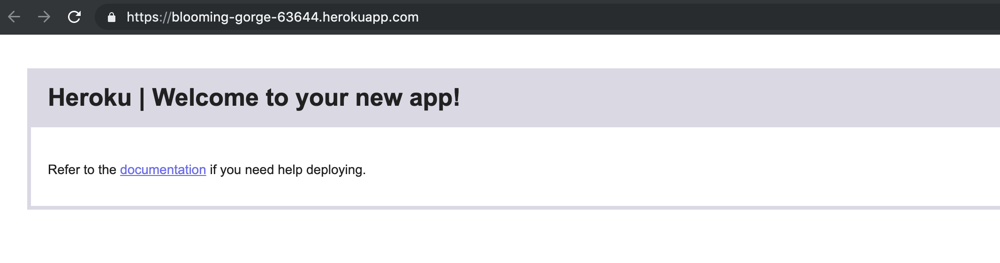
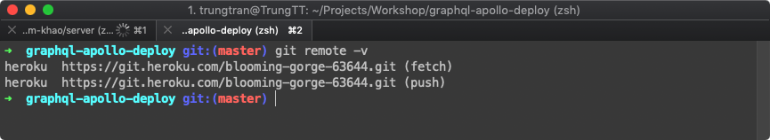
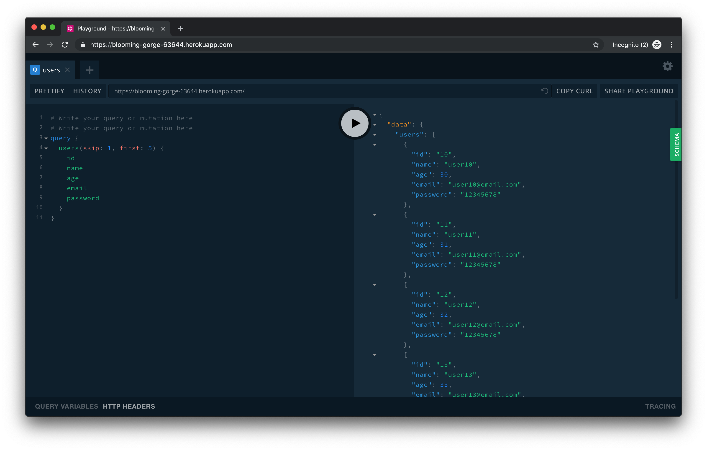

# Table of contents

- [Deploy Nodejs Application (GraphQL Server)](#1)
  - [a. Prepare Heroku](#prepare)
  - [b. Config Lại GraphQL Server](#config)
  - [c. Bắt đầu deploy](#deploy)
- [Summary](#Summary)

---

### 1. Deploy Nodejs Application (GraphQL Server): <a id="1"></a>

Hiện tại chúng ta đang chạy **GraphQL Server** ở máy local.
Chỉ có **Prisma service** và **Database** là sử dụng dịch vụ và clould-db của Prisma.

Việc cần làm ở bài này là deploy GraphQL Server lên máy chủ nào đó. Để chúng ta có được một Application thực sự có thể truy cập từ bất cứ đâu và bất cứ khi nào.

Chúng ta sẽ sử dụng [Heroku](https://www.heroku.com/what "Heroku is a cloud platform that lets companies build, deliver, monitor and scale apps — we're the fastest way to go from idea to URL, bypassing all those infrastructure headaches.") để deploy.

#### a. Prepare Heroku <a id="prepare"></a>

Chạy lệnh sau để cài đặt heroku-cli

```shell
npm install -g heroku
```

Trong lúc đợi cài đặt xong hãy đăng ký 1 tài khoản heroku: https://www.heroku.com/ như sau, (_nhớ dùng email và tên của bạn_ 🙄):



Chờ email xác nhận và cài đặt mật khẩu.

Sau khi cài đặt Heroku-CLI và đăng ký tài khoản thành công.
Đăng nhập thử bằng lệnh dưới đây xem sao 🧐

```shell
heroku login
```



Như hình trên là thành công 🎉 🎊

<br/>

#### b. Config Lại GraphQL Server: <a id="config"></a>

##### Update lại file `graphql-apollo-tutorial/bai-tap/server/src/index.js`

```diff
- server.listen().then(({ url }) => {
+ server.listen({port: process.env.PORT || 4000}).then(({ url }) => {
  console.log(`🚀  Server ready at ${url}`);
});
```

🤔 **Vì sao lại cần update lại port của GraphQL Server?**

- Mặc định của GraphQL server là sẽ dùng port 4000. Nên từ bài đầu tới giờ chúng ta không hề config port của server những vẫn có thể access từ link: http://localhost:4000

- Tuy nhiên Khi deploy lên heroku chúng ta không thể sử dụng port 4000 được nữa mà phải chuyển sang sử dụng port do heroku cung cấp thông qua **process.env.PORT**.

##### Update lại file `graphql-apollo-tutorial/bai-tap/server/package.json`

```diff
"scripts": {
    "test": "jest",
-   "start": "nodemon --exec babel-node src/index.js",
+   "dev": "nodemon --exec babel-node src/index.js",
+   "start": "node dist/index.js",
+   "heroku-postbuild": "babel src --out-dir dist --copy-files",
    "start:ci": "node --exec babel-node src/index.js"
},
```

⁉️ **Vì sao cần phải update lại scripts của package.json**

**Thứ 1**:

- `nodemon` không thích hợp dùng cho bản production, chỉ được dùng để phục vụ cho quá trình develop.
- Và mặc định heroku sẽ sử dụng câu lệnh `start` để run app của chúng ta. Vì vậy chúng ta cần phải đổi tên câu lệnh `start` ban đầu thành `dev` _(hoặc tên khác tùy bạn)_.

**Thứ 2**:

- GraphQL server của chúng ta sử dụng rất nhiều syntax mới của ES6. Để đảm bảo cho việc hoạt động ổn định trên server. Ta sẽ sử dụng babel để build lại source. Cần cài thêm vài module: @babel/pollyfill và @babel/runtime... đã được update trong package.json. Bạn cần phải chạy lại lệnh `npm install`.
- `heroku-postbuild` là câu lệnh dùng để build của heroku sẽ được thực hiện khi bạn tiến hành deploy. [Xem thêm tại đây](https://devcenter.heroku.com/articles/nodejs-support#customizing-the-build-process)
- Và câu lệnh `start` sẽ update lại gọi file trong thư mục được build **dist**:
  `"start": "node dist/index.js"`

<br/>

#### c. Bắt đầu deploy lên Heroku thôi: <a id="deploy"></a>

- Chạy câu sau để khởi tạo 1 application

  ```shell
  heroku create
  ```

  

  `blooming-gorge-63644` là tên của được tự động tạo ra ngẫu nhiên.

- Chạy lệnh sau để Setting buildpack cho heroku

  ```shell
  heroku buildpacks:set heroku/nodejs
  ```

* Bạn click vào đường link để xem app của mình. _(ở đây là: https://blooming-gorge-63644.herokuapp.com/)_ Hiện tại bạn sẽ chỉ thấy 1 empty app như hình sau:

  

* Việc deploy về bản chất chỉ là chúng ta push code lên repository của heroku. Bạn có thể thấy link git của heroku khi chúng ta khởi tạo app.
  _https://git.heroku.com/blooming-gorge-63644.git_

- Chúng ta cần phải tạo 1 repo khác dùng cho deploy. Bởi vì cấu trúc thư mục của repo hiện tại không phù hợp để deploy.
  Copy nội dung thư mục `bai-tap/server` ra thư mục mới (**graphql-apollo-deploy**) nằm cùng cấp với folder `graphql-apollo`. Cấu trúc thư mục sẽ như sau:

  ```
  +--graphql-apollo
  |       |
  |       +--graphql-apollo-tutorial
  |       |       |
  |       |       +--bai-tap/server
  |       |       |
  |       |       +--tham-khao/server
  |       |
  |       +--image
  |       +--README.md
  |
  +--graphql-apollo-deploy
          |
          +--dist
          |
          +--node_modules
          |
          +--prisma-db
          |
          +--src
          |
          +--package.json
  ```

- Đứng ở thư mục **`graphql-apollo-deploy`** chạy lệnh:

  ```
  git init
  ```

- Add link này như là 1 git remote bằng câu lệnh sau

  ```
  git remote add heroku https://git.heroku.com/blooming-gorge-63644.git
  ```

  Dùng lệnh `git remote -v` để check kết quả

  

  Như hình trên là thành công

- Gõ lệnh add để thêm các file chưa được track.

  ```
  git add .
  ```

- Gõ lệnh để commit.

  ```
  git commit -m "Prepare to deploy"
  ```

- Bước cuối cùng push lên remote heroku để deploy

  ```
  git push heroku master
  ```

  > :warning: **Nâng cao:** _bạn có thể dùng git lồng trong git để deploy heroku mà không cần phải tách cấu trúc thư mục._

- Truy cập lại link app để test https://blooming-gorge-63644.herokuapp.com/ bạn sẽ truy cập được playground thay vì empty app nữa. Tuy nhiên bạn không thể query gì được cả.

<br/>

- Update lại file `src/index.js` thêm 2 config ở dưới.

  ```diff
  const server = new ApolloServer({
  + playground: true,
  + introspection: true,
    typeDefs,
    resolvers,
    context: req => ({
      prisma,
      req
    })
  });
  ```

- Chạy lại các lệnh git để deploy

  ```
  git add .
  git commit -m "Prepare to deploy"
  git push heroku master
  ```

- Check lại App.

  

  🎉 🎉 🎉 Vậy là deploy thành công. Chúng ta đã có 1 GraphQL Server Production. Có thể truy cập ở bất cứ đâu.

---

### 2. Tóm tắt lại kiến thức đã học: <a id="Summary"></a>

Vậy là chúng ta đã cùng nhau đi được hơn 1 nửa chặng đường:

- Chúng ta đã biết được GraphQL là gì, các khái niệm cơ bản của GraphQL và Query ở [lesson2](https://github.com/vitalifyjp/vfa-workshop-graphql-apollo/tree/lesson2)
- Cùng nhau tìm hiểu về Mutation và Subscription ở [lesson3](https://github.com/vitalifyjp/vfa-workshop-graphql-apollo/tree/lesson3)
- Tương tác trực tiếp với DB ở [lesson4](https://github.com/vitalifyjp/vfa-workshop-graphql-apollo/tree/lesson4)
- Authentication ở [lesson5](https://github.com/vitalifyjp/vfa-workshop-graphql-apollo/tree/lesson5)
- Pagination và Sorting ở [lesson6](https://github.com/vitalifyjp/vfa-workshop-graphql-apollo/tree/lesson6)
- Và ở bài này chúng ta đã biết cách build và deploy 1 bản production.

Vậy là bạn đã biết gần như đầy đủ các kiến thức cơ bản về GraphQL rồi đấy.

- Trong 2 lesson tới (lesson8 và lesson9), chúng ta sẽ sử dụng những kiến thức đã được học từ đầu đến giờ và sử dụng 1 Platform hỗ trợ GraphQL rất nổi tiếng là Apollo để cùng nhau tạo 1 sản phẩm cụ thể ở đây là 1 forum, có các chức năng: như đăng bài, comment, chat...

Bạn đã sẵn sàng. 💪
